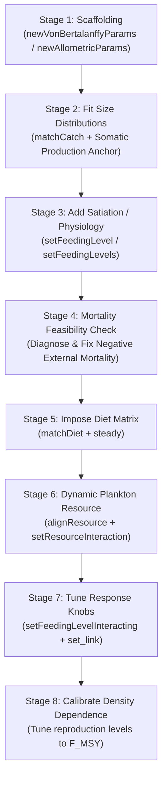

# Calibrating Mizer Models with Size Distributions and Diet

This skill guides agents through building and calibrating a multi-species `mizer` model using the **invariance-preserving multi-stage workflow** developed in `mizerEcopath`.

The central design principle is **decoupling steady-state fitting from dynamic-response tuning**:
1. **Steady-state calibration (Stages 1–6)**: Sequentially fits life-history growth, size spectra, yield, biomass, diet composition, and plankton resource by transferring encounter and mortality from anonymous external terms to explicit terms (`matchCatch`, `matchDiet`, `setResourceInteraction`) without altering total energy or mortality.
2. **Dynamic response tuning (Stages 7–8)**: Tunes parameters ($f$, $\text{resource\_level}$, link attenuation $\lambda$, reproduction level $r_l$) that control *elasticities* and perturbation responses while leaving the steady state, biomass, size distributions, and Ecopath ratios invariant to machine precision.

Every function returns a **new `MizerParams` object** — always reassign (`params <- f(params, ...)`).

---

## Setup and Helper Functions

Load the required libraries and calibration helper functions:

```r
library(dplyr)
library(ggplot2)
library(mizer)
library(mizerExperimental)
library(mizerEcopath)

# Load calibration helpers (provides setFeedingLevelInteracting, set_link, tune_peak, catch_nll, etc.)
helpers_path <- if (file.exists("inst/calibration_helpers.R")) {
    "inst/calibration_helpers.R"
} else {
    system.file("calibration_helpers.R", package = "mizerEcopath")
}
source(helpers_path)
```

### Available Helper Functions Reference

| Helper Function | Key Arguments | Purpose & Invariant Preserved |
|---|---|---|
| `setFeedingLevelInteracting()` | `params`, `f_new` | Sets feeding level $f$ on an interacting model without altering steady-state consumption, predation mortality, or diet matrix. |
| `set_link()` | `params`, `pred`, `prey`, `lambda` | Attenuates interaction $\theta_{pred,prey}$ by multiplier $\lambda$, shifting feedback into inert external terms without moving steady state. |
| `tune_peak()` | `params`, `s`, `F_t`, `rl_lo`, `rl_hi`, `tol` | Bisects reproduction level $r_l$ in $u = -\log(1-r_l)$ on full yield curve to place peak at $F_{MSY}$. Safe for bimodal curves. |
| `cap_rl()` | `params`, `s`, `rl_hi`, `rl_lo` | Caps upper reproduction level search bound to ensure physical feasibility ($e_\text{repro} \le 1$). |
| `catch_nll()` | `params`, `catch` | Computes excess multinomial negative log-likelihood per fish for survey and commercial gear fits. |
| `F_targets()` | `params` | Extracts target $F_{MSY}$ values, falling back to fitted commercial catchability for unassessed species. |

---

## Required Data & Observation Model

### 1. Species Parameters (`sp`)
A data frame with one row per species containing:
- Life history: `species`, `w_inf` (or `l_inf`), `a`, `b` ($w = a l^b$), `w_mat`, `age_mat`, `k_vb`, `t0`, `w_min`, `l_max`.
- Observations: `biomass_observed`, `biomass_cutoff` (minimum size in grams included in survey biomass; prevents small uncounted fish from distorting calibration), `FMSY` (target fishing mortality from stock assessment).

### 2. Gear Setup: The Two-Gear Technique (`gp`)
Every species should receive **two gears**:
- **`survey` gear**: `catchability = 1e-12`, `yield_weight = 0`, `yield_observed = 1e-10`. Exists only to fit survey size distributions; contributes no fishing mortality and no yield.
- **`commercial` gear**: `catchability = 1` (starting), `yield_weight = 1`, `yield_observed = <annual_yield>`, `sel_func = "sigmoid_length"`. Fills the actual fishery role.

> [!TIP]
> **Domed Survey Gears**: If survey catches for a species fall off at large sizes faster than a monotonic sigmoid can accommodate, assign `sel_func = "double_sigmoid_length"` with `l50_right` and `l25_right` **only to the survey gear**. Never dome the commercial gear unless directly supported by gear selectivity data, as commercial selectivity defines the actual fishing mortality $F(w)$.

### 3. Catch Size Distributions (`catch`)
A data frame containing numbers of fish in length bins (`length`, `dl`, `catch`) per species and gear. Commercial counts should be rescaled to match total survey counts so both gears contribute balanced likelihood weights.

### 4. Diet Matrix (`dm`)
A predator $\times$ prey matrix of diet proportions where row sums equal 1, containing an `other` column collecting non-modelled prey.

---

## The 8-Stage Calibration Workflow



---

### Stage 1: Single-Species Scaffolding

Construct a non-interacting baseline model where all food and mortality are external:

```r
# Configure domed survey selectivity where needed (example: Megrim, Blue whiting, Plaice)
domed <- c("Megrim", "Blue whiting", "Plaice")
gp$l50_right <- NA_real_; gp$l25_right <- NA_real_
dome_sel <- gp$gear == "survey" & gp$species %in% domed
gp$sel_func[dome_sel] <- "double_sigmoid_length"
l_max_dome <- sp$l_max[match(gp$species[dome_sel], sp$species)]
gp$l50_right[dome_sel] <- 0.75 * l_max_dome
gp$l25_right[dome_sel] <- 0.95 * l_max_dome

# Choice A: von Bertalanffy growth (Recommended)
p <- newVonBertalanffyParams(sp)

# Choice B: Pure power-law allometric growth
# p <- newAllometricParams(sp)

gear_params(p) <- gp
initial_effort(p) <- 1

p <- steadySingleSpecies(p) |> setBevertonHolt()
p <- matchBiomasses(p)
```

- **`newVonBertalanffyParams()` advantages**: Follows exact von Bertalanffy growth $dw/dt = Aw^n - Bw$; metabolic loss $Bw$ is explicitly represented; handles negative $t_0$ via juvenile growth speed-up below $w_{mat}$.
- **`newAllometricParams()`**: Encounter and natural mortality are pure power laws; $h = \infty, k_s = 0$.

---

### Stage 2: Matching Size Distributions and Yields (`matchCatch`)

Anchor external mortality to default somatic production so the optimizer does not drift into unbiological parameter regimes:

```r
# In steady state, somatic production equals mortality loss
species_params(p)$production_observed <- getSomaticProduction(p)

# Fit selectivity (l50, l25), commercial catchability, growth diffusion (D_ext), and external mortality (z_ext)
pm <- matchCatch(p, catch = catch)
```

`matchCatch()` optimizes parameters simultaneously using TMB, preserving energy available for growth. Check fit quality via excess negative log likelihood per fish:
```r
nll <- catch_nll(pm, catch)
```

---

### Stage 3: Adding Satiation / Feeding Level

Introduce finite maximum intake $h$ without changing consumption $(1-f)E$ or growth:

```r
# For von Bertalanffy models (metabolism Bw already present):
pm <- setFeedingLevel(pm, feeding_level = 0.6)

# For allometric models (introduces critical feeding level f_c = f/3):
# f <- setNames(rep(0.6, nrow(sp)), sp$species)
# pm <- setFeedingLevels(pm, f = f, f_c = f / 3)
```

- Elasticity of consumption to food is $\frac{\mathrm{d}\log C}{\mathrm{d}\log E} = 1 - f$.
- Fish near satiation ($f \to 1$) grow less in response to competitor removal.

---

### Stage 4: Mortality Budget Feasibility for Diet Matrix

Test whether total mortality can support the predation required by the diet matrix:

```r
# Test run
pd <- matchDiet(pm, reduced_dm)
```

If warnings indicate **negative external mortality** ($z_{ext} < 0$), explicit predation exceeds total mortality. Apply one of two fixes:

1. **Increase Prey Somatic Production** (for general prey):
   ```r
   species_params(pm)["Hake", "production_observed"] <- 1.5 * species_params(pm)["Hake", "production_observed"]
   pm <- matchCatch(pm, catch = catch, species = "Hake")
   ```
2. **Weaken Predator Cannibalism in Diet Matrix** (when predation is entirely self-inflicted):
   ```r
   lambda_cod <- 0.2
   dm <- reduced_dm
   dm["Cod", "other"] <- dm["Cod", "other"] + (1 - lambda_cod) * dm["Cod", "Cod"]
   dm["Cod", "Cod"]   <- lambda_cod * dm["Cod", "Cod"]
   ```

---

### Stage 5: Impose Species Interactions (`matchDiet`)

Translate diet proportions into interaction matrix $\theta_{ij}$, subtracting explicit predation from external terms:

```r
pd <- matchDiet(pm, dm)
ps <- steady(pd, tol = 1e-10)
```

`steady()` re-settles minor residual clippings at zero for large individuals.

---

### Stage 6: Integrate Dynamic Plankton Resource

Let a semichemostat plankton resource absorb remaining external encounter:

```r
psr <- alignResource(ps)
resource_params(psr)$w_pp_cutoff <- 1 # Cut off at 1 g to prevent large fish from constraining resource
initialNResource(psr)[w_full(psr) > 1] <- 0
comment(psr@cc_pp) <- NULL

psr <- setResourceInteraction(psr, resource_dynamics = "resource_semichemostat", tol = 1e-2)
psr <- steady(psr, tol = 1e-10)

resource_level(psr) <- 0.5 # Sets push-back elasticity: dlog(N_R)/dlog(mu) = -(1 - resource_level)
psr <- steady(psr, tol = 1e-12, t_max = 200)
```

---

### Stage 7: Tune Response Knobs (Elasticities & Link Attenuation)

If a species' yield curve in Stage 8 peaks far above its $F_{MSY}$ target even at minimum reproduction level ($r_l = 0.005$), use response knobs that alter elasticity without disturbing the steady state:

#### A. Interacting Feeding Level Knob
```r
# Raise feeding level on resource-heavy species to damp explosive growth responses
f <- setNames(rep(0.6, nrow(sp)), sp$species)
f[["Herring"]] <- 0.94
psr <- setFeedingLevelInteracting(psr, f)
```

#### B. Link Attenuation Knob
```r
# Weaken strong predator-prey links or cannibalism, handing food and mortality back to inert external pools
allsp <- species_params(psr)$species
psr <- set_link(psr, "Whiting", allsp, 0.65)
psr <- set_link(psr, "Cod", allsp, 0.01)
```

> [!IMPORTANT]
> **Restoration Order in `set_link`**: Always restore `ext_encounter` **before** `ext_mort`. Predation mortality depends on $(1-f)$, which depends on encounter rate; restoring mortality first bakes spurious external mortality into prey species.

---

### Stage 8: Calibrate Density-Dependent Reproduction to $F_{MSY}$ Targets

Bisect the Beverton-Holt reproduction level $r_l$ for each species so that the global maximum of its yield-vs-$F$ curve sits at $F_{MSY}$ (or fitted current $F$ if $F_{MSY}$ is unavailable):

```r
Ft <- F_targets(psr)
params <- psr

# Parallel Jacobi sweep (2-3 sweeps to converge cross-species feedback)
for (sweep in 1:3) {
    res <- parallel::mclapply(names(Ft), function(s) {
        r <- tune_peak(params, s, Ft[[s]], steps = 7, tol = 0.10)
        r$species <- s
        r
    }, mc.cores = min(6, parallel::detectCores()))
    for (r in res) params <- set_rl(params, r$species, r$rl)
}
```

Validate the resulting peaks on a fine grid with tight tolerance (`tol = 1e-3`, `t_max = 200`).

---

## Validation & Verification Checklist

After completing calibration, execute this diagnostic suite:

| Diagnostic Target | Inspection Tool | Acceptance Criterion |
|---|---|---|
| **Steady-State Stability** | `summary(params)`, `project(params, t_max = 20)` | Biomass drift $< 10^{-4}$/year across all species |
| **Biomass & Yield Targets** | `plotBiomassVsSpecies(params)`, `plotYieldVsSpecies(params)` | Exact match (discrepancies $\le 3\%$ from residual encounter clipping) |
| **Catch Size Distributions** | `plotYieldVsSize(params, catch = catch, x_var = "Length")` | Matches mode, spread, and slope of survey and commercial distributions |
| **Growth Rates** | `plotGrowthCurves(params, species_panel = TRUE)` | Realized growth aligns with von Bertalanffy trajectories |
| **Diet Composition** | `plotDiet(params)` | Smooth transitions from resource to fish prey with size |
| **Mortality Attribution** | `plotlyDeath(params)` / `plotDeathX(params)` | Predation forms a juvenile hump; external mortality covers larvae and unmodelled prey |
| **Reproductive Efficiency** | `plotReproductiveEfficiency(params)` | Realised efficiency $\text{erepro} \times (1 - r_l) < 1.0$ (never exceeds physical egg limits) |
| **Yield Curve Peaks** | `getYieldVsF(params)` | $F_\text{peak} / F_\text{target} \in [0.90, 1.10]$ |

---

## Failure Modes and Troubleshooting Guide

### 1. `matchDiet()` warns of negative external mortality
- **Cause**: Predator consumption in the diet matrix demands more mortality on prey than the prey's total mortality in the model.
- **Fix**: Multiply prey's `production_observed` by $1.5\times$ and refit with `matchCatch(pm, catch, species = prey)`, or weaken predator cannibalism/predation on the prey in the diet matrix.

### 2. Survey catch distribution falls off steeply at large sizes
- **Cause**: Survey gear avoids large fish; monotonic sigmoid forces the size spectrum to collapse artificially.
- **Fix**: Set `sel_func = "double_sigmoid_length"` on the **survey gear only**. Never dome commercial gear without fishery selectivity data.

### 3. Yield curve peak sits stubbornly high above $F_{MSY}$ at $r_l = 0.005$
- **Cause**: Strong food-web compensation (predation release on juveniles, or rapid growth on resource).
- **Fix**:
  - If species feeds heavily on resource (e.g. Herring), raise feeding level via `setFeedingLevelInteracting(psr, f)` to damp growth response.
  - If mortality is driven by cannibalism or predation (e.g. Cod, Whiting), weaken interaction links via `set_link(psr, pred, prey, lambda)` to shift feedback into inert external mortality.

### 4. Yield curve bimodal or tuning fails with two-point test
- **Cause**: Depensatory or complex multi-gear feedbacks create multiple local maxima.
- **Fix**: Use full curve scan (`tune_peak()` with `peak_ratio()`) rather than local slope comparisons.

### 5. Conflict between fitted current $F$ and assessment $F_{MSY}$
- **Cause**: If current fitted $F \gg F_{MSY}$ (e.g., Cod $F_\text{fitted} = 0.88$ vs $F_{MSY} = 0.29$), a stock calibrated at equilibrium at $F_\text{fitted}$ will peak above $F_{MSY}$ by arithmetic necessity.
- **Trade-off**: Choose between (a) strictly fitting the size data with peak slightly above $F_{MSY}$, or (b) asserting a smaller commercial $l_{50}$ to force $F_\text{peak} \to F_{MSY}$ at the cost of catch-at-length likelihood.
