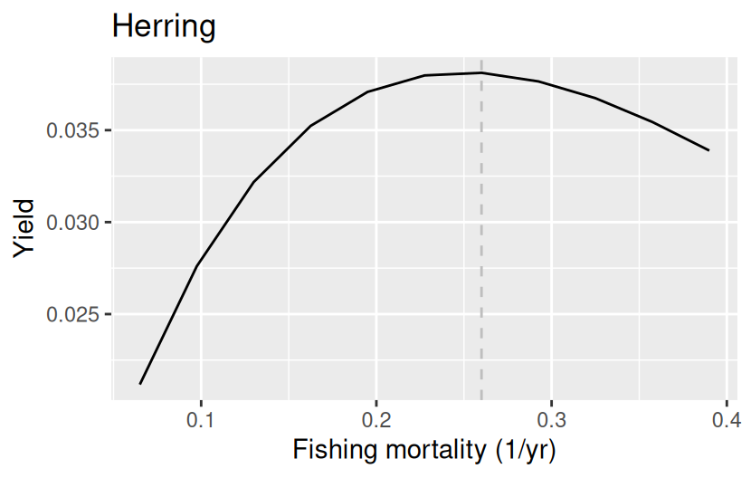
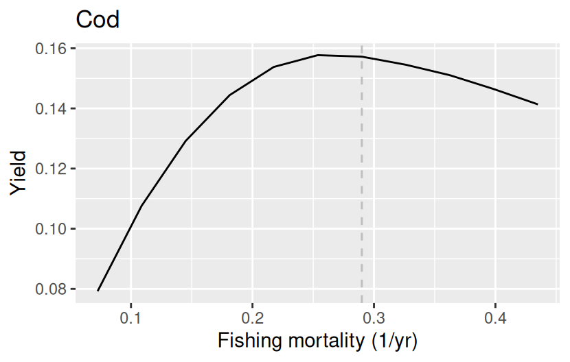
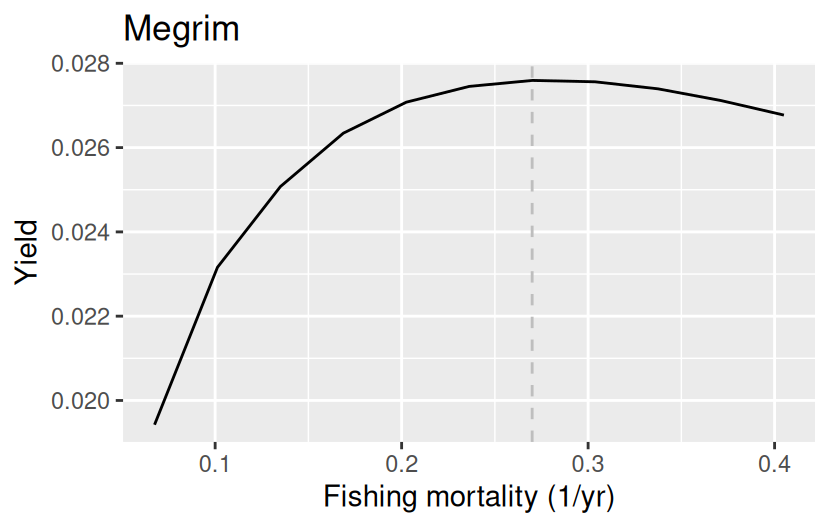
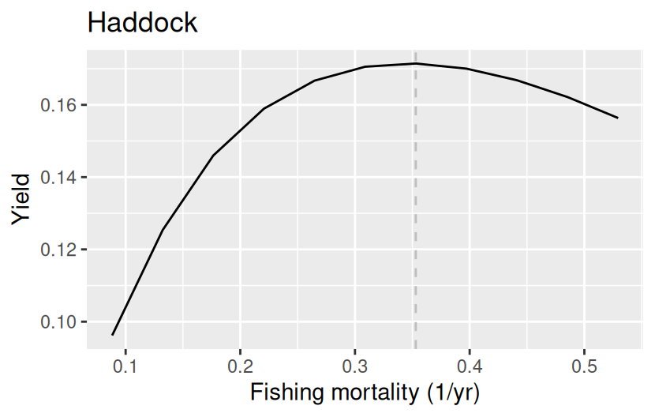
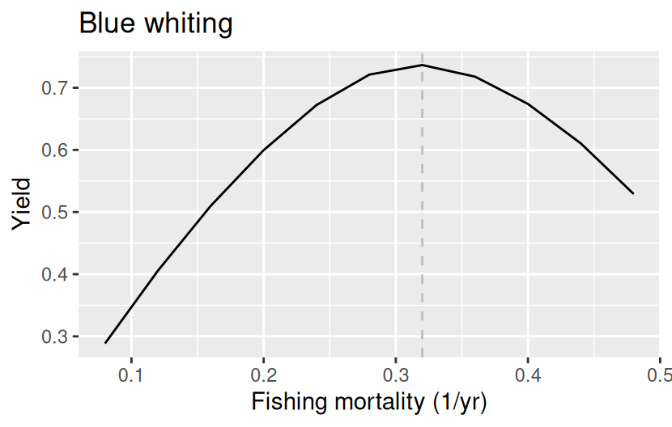
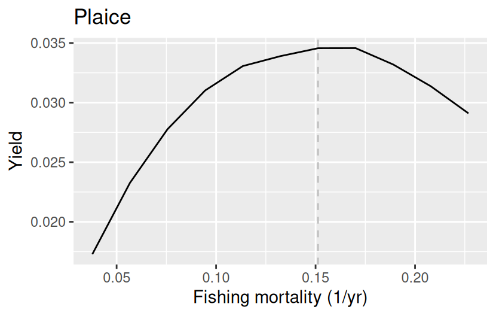
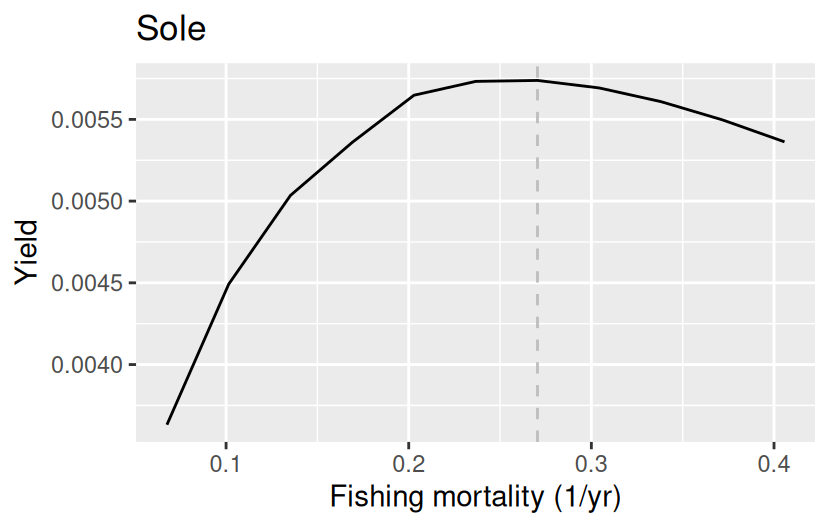

```{r}
#| label: setup
#| message: false
#| warning: false
library(dplyr)
library(ggplot2)
library(mizer)
library(mizerExperimental)
library(mizerEcopath)
library(knitr)

# The data file lives in `inst/`, which is at a different place depending on
# whether this document is rendered from the package root, from `vignettes/`,
# or from an installed copy of the package.
pkg_file <- function(name) {
    for (p in c(name, file.path("inst", name), file.path("..", "inst", name))) {
        if (file.exists(p)) return(p)
    }
    system.file(name, package = "mizerEcopath")
}
```

## What this document is

This document builds a nine-species mizer model of the Celtic Sea from data assembled by Richard and Jess, and then shows what the resulting model looks like. It is meant to explain the *method* to collaborators: what each step does, why it is needed, and where the judgement calls are.

The model is built in a sequence of stages. Each stage adds one piece of biological structure, and each stage is arranged so that it does not destroy what the previous stages achieved. That is the central idea, and it is worth stating up front:

1.  **Single-species scaffolding.** Start from a model in which every species grows and dies according to pure power laws and nothing interacts with anything. Such a model can be solved essentially by hand, so we can put it exactly where we want it.
2.  **Fit to size data.** Adjust gear selectivity, catchability and external mortality so that the steady state reproduces the observed catch and survey size distributions, the observed yield, and the observed biomass.
3.  **Add physiology.** Introduce a finite maximum intake rate and a metabolic cost, *without* changing the energy available for growth and reproduction, so the fit from stage 2 survives.
4.  **Give three species more mortality**, because otherwise the diet matrix in the next stage cannot be imposed.
5.  **Add species interactions.** Replace part of the anonymous "external" food and mortality by explicit predation, chosen to reproduce an observed diet matrix — again arranged to preserve the steady state.
6.  **Add the resource.** Let a dynamic plankton resource absorb as much as possible of the remaining external food.
7.  **Weaken cod's cannibalism**, because it is what keeps cod's yield curve peaking far above the fishing mortality we want to target.
8.  **Add density dependence.** Choose the reproduction level of each species so that the model's yield-versus-fishing-mortality curve peaks near the species' $F_{MSY}$.

A theme runs through stages 3, 6, 7 and 8 that is worth naming, because it is what makes the later stages possible at all. Each of them changes only how the model *responds* to being perturbed, while leaving the steady state — and hence every quantity the earlier stages fitted — exactly where it was. The feeding level, the resource level, the strength of cannibalism and the reproduction level are all knobs of this kind. They are invisible to the biomass, the size distributions and the Ecopath ratios, and they are the only things left to choose once those have been matched.

Stages 1 to 7 are run live below and take about a minute. Stage 8 takes roughly half an hour, so its code is shown but not executed; the recorded results are reproduced instead.

## The data

```{r}
#| label: load-data
load(pkg_file("data_Richard_and_Jess.rda"))
```

The file `inst/data_Richard_and_Jess.rda` was produced by `inst/combine_data_from_Richard_and_Jess.R`. It contains three objects.

### Species parameters `sp`

Nine species: `r paste(sp$species, collapse = ", ")`.

The life-history parameters (length–weight coefficients `a`, `b`, maturity size and age, `w_inf`, von Bertalanffy `k_vb` and `t0`) come from James's compilation. The predation-kernel parameters come from Jess's Celtic Sea model: a `power_law` kernel, which is a smoothly truncated power law specified by the four exponents `kernel_l_l`, `kernel_u_l`, `kernel_l_r`, `kernel_u_r` rather than by the usual lognormal `beta`/`sigma`. The observed biomasses are Richard's, in t/km².

```{r}
#| label: sp-table
sp |>
    select(species, a, b, w_mat, age_mat, w_inf, k_vb,
           biomass_observed, l_max, biomass_cutoff) |>
    kable(digits = 3,
          caption = "Life-history and observation parameters.")
```

Two entries deserve comment.

`biomass_cutoff` is the weight of a 20 cm fish. Richard's biomass estimates come from survey catches, and the survey does not see fish much below 20 cm reliably, so `biomass_observed` is treated as the biomass *above* that cutoff rather than the biomass of the whole population. Without this the model would be asked to match an observed biomass against a modelled biomass that includes a large number of small fish that were never counted.

`D_ext = 1` switches on growth diffusion. Individuals of the same species and age do not all grow at exactly the same rate, and modelling that spread as a diffusion in size broadens the modelled size distribution, which matters when we are about to fit to observed size distributions.

### Gear parameters `gp`

```{r}
#| label: gp-table
gp |> filter(species %in% c("Herring", "Cod")) |>
    kable(digits = 4, caption = "Gear parameters for two of the nine species.")
```

Every species gets **two** gears:

- a `survey` gear with catchability $10^{-12}$, i.e. effectively zero, and `yield_weight = 0`;
- a `commercial` gear carrying the observed yield, with `yield_weight = 1`.

This is a device for feeding two different kinds of size information into the same fit. The survey gear exists only to give the survey size distribution a selectivity curve of its own; because its catchability is negligible it removes no fish and contributes no yield, and its `yield_observed` is set to a token $10^{-10}$ so that it is not mistaken for missing data. The commercial gear is the one that actually fishes and the one whose yield is matched.

Both gears start from a `sigmoid_length` selectivity with round-number $l_{50}$ and $l_{25}$; these are starting values only, since the fit will move them.

### Size distributions `catch`

```{r}
#| label: catch-table
catch |> filter(species == "Cod", length %in% c(20, 40, 60)) |>
    select(species, gear, length, dl, catch) |>
    arrange(gear, length) |>
    kable(digits = 2, caption = "A few rows of the size-distribution data.")
```

Numbers of fish in 1 cm length bins, for each species and gear.

- The **commercial** distribution is Richard's, computed as $F_\text{mean} \times$ density, so that it is consistent with the yields we are matching.
- The **survey** distribution is Jess's, which is used in preference to Richard's because it extends below 20 cm.

The commercial distribution is then rescaled so that it contains the same total number of fish as the survey distribution. Only the *shape* of a catch distribution enters the likelihood, so this rescaling changes nothing about the fit; it just stops one gear from dominating simply by having larger numbers.

The data covers sixteen species; the seven that are not among the nine in `sp` are simply ignored, as are the `NA` entries at lengths where a species was not measured.

### Diet matrix

The diet matrix `reduced_dm` is a package dataset, derived from Ecopath diet compositions with `reduceEcopathDiet()`. It is 14×15: fourteen predators, fourteen prey plus an `other` column collecting everything that is not one of the modelled species. Rows are diet proportions.

```{r}
#| label: dm-table
round(reduced_dm[c("Cod", "Hake", "Megrim"),
                 c("Blue whiting", "Haddock", "Herring", "Whiting", "other")],
      3) |>
    kable(caption = "Part of the diet matrix: proportion of each predator's diet.")
```

Note how large the `other` column is. Most of what these fish eat is not one of the nine modelled species, and that is the part the model has to represent as external food or, later, as the plankton resource.

## Stage 1: the allometric starting model

```{r}
#| label: allometric
#| code-fold: show
#| message: false
#| warning: false
p <- newAllometricParams(sp)
gear_params(p) <- gp
initial_effort(p) <- 1

p <- steadySingleSpecies(p) |>
    setBevertonHolt()
p <- matchBiomasses(p)
```

`newAllometricParams()` builds a model in which

- the encounter rate is a pure power law $E_i(w) = E_i w^n$ with $n = 0.7$,
- the natural mortality rate is a pure power law $\mu_i(w) = \mu_i w^{n-1}$,
- maximum intake is infinite ($h = \infty$) and metabolic respiration is switched off ($k_s = 0$), so the feeding level is zero,
- species do not interact, either with each other or with the resource: all food is "external",
- the reproduction level is zero, i.e. reproduction is fully density-independent.

The two power-law coefficients are pinned down by two requirements: the encounter coefficient $E_i$ is chosen so that the species reaches `w_mat` at age `age_mat`, and the mortality coefficient $\mu_i$ is then chosen so that the juvenile biomass spectrum has slope $-0.2$.

This is a deliberately impoverished model, and that is the point. Because nothing interacts, each species can be solved independently and put exactly where we want it, which gives the later stages a well-defined starting point.

## Stage 2: matching the size distributions

### Anchoring the mortality

```{r}
#| label: production-anchor
#| code-fold: show
species_params(p)$production_observed <- getSomaticProduction(p)
```

This one line is worth dwelling on. The fit in the next step is free to change the external mortality coefficient `z_ext`, and with only size distributions and a yield to constrain it, it can wander a long way from anything sensible.

In steady state, mortality and production are two sides of the same coin: what a cohort produces in new tissue is exactly what mortality removes. So we can constrain mortality indirectly by telling the optimiser to keep production close to the value the default model already has. We are not claiming to have *observed* the production — we are using `production_observed` as a regularisation term that says "stay near the default mortality unless the size data give you a good reason not to".

### The fit

```{r}
#| label: matchCatch
#| code-fold: show
#| message: false
#| warning: false
pm <- matchCatch(p, catch = catch)
```

`matchCatch()` adjusts, per species, the selectivity parameters $l_{50}$ and $l_{25}$ of both gears, the catchability of the commercial gear, and the external mortality coefficient `z_ext`, by minimising

- the negative log likelihood of the observed catch size distributions given the size distributions the model predicts, plus
- the squared difference in log yield (commercial gear only, because the survey gear has `yield_weight = 0`), plus
- the squared difference in log production, i.e. the anchor above.

The reason selectivity and mortality have to be fitted *together* is that the model's predicted catch distribution is the product of the selectivity curve and the species' size spectrum, and the size spectrum is itself shaped by the balance between growth and mortality. Fitting a selectivity curve against a fixed spectrum, or a mortality against a fixed selectivity, would both be wrong. The objective function is written in C++ and differentiated automatically by TMB, which is what makes a joint fit over four parameters per species per gear practical.

After the fit, the biomass is rescaled to the observation and the reproduction level is reset to zero.

## Stage 3: giving the fish a physiology

```{r}
#| label: feeding-levels
#| code-fold: show
#| message: false
#| warning: false
# Note that setFeedingLevels() assigns `f` and `f_c` *positionally*: the names
# below are for our benefit only, and the vector must be in the same order as
# species_params(pm). It is, because both come from `sp`.
f <- setNames(rep(0.6, nrow(sp)), sp$species)
f[["Whiting"]] <- 0.8406          # see "What the feeding level buys" below

pm <- setFeedingLevels(pm, f = f, f_c = f / 3)
```

So far the fish have infinite maximum intake and no metabolic cost, which is convenient but not believable. `setFeedingLevels()` introduces a feeding level $f$ (the fraction of its maximum rate at which a fish eats) and a critical feeding level $f_c$ (below which it cannot grow at all) by solving for the encounter rate $E$, maximum intake $h$ and metabolic loss $k_s$ that produce them:

$$E=E_r\frac{f}{\alpha(f-f_c)(1-f)},\qquad
  h = \frac{E_r}{\alpha(f-f_c)},\qquad
  k_s = E_r\frac{f_c}{f-f_c}.$$

The point of solving it this way is that the energy available for growth and reproduction, $E_r$, is held fixed. The fish now have a realistic physiology, but they grow exactly as they did before, so the size-distribution fit from stage 2 is not disturbed.

### What the feeding level buys {#sec-feeding-level}

Eight of the nine species get the conventional $f = 0.6$, $f_c = 0.2$. Whiting gets $f = 0.8406$, $f_c = 0.2802$, and the reason is worth setting out, because it turns on a property of these formulae that is easy to miss.

Substituting $h$ back into the consumption rate $f\,h\,w^n$ gives

$$\text{consumption} = \frac{E_r}{\alpha\left(1 - f_c/f\right)},
  \qquad k_s = E_r\,\frac{f_c/f}{1 - f_c/f},$$

both of which depend on $f$ and $f_c$ **only through their ratio**. So the Ecopath quantities this stage could damage — the consumption $Q/B$ and the respiration — are fixed by $f_c/f$ alone, while the overall *level* of $f$ is free. Keeping $f_c = f/3$ throughout, as the code above does, means Whiting's raised feeding level changes neither its steady state nor any Ecopath ratio. Rebuilding the model with $f$ raised from 0.6 to 0.9 for every species moves $Q/B$ and $P/B$ by less than 0.2% and the size spectra by less than 2%.

What the level of $f$ does change is how strongly growth responds to a change in food supply. Since $\mathrm{d}f/\mathrm{d}\log E = f(1-f)$,

$$\frac{\mathrm{d}\log E_r}{\mathrm{d}\log E}
  = \frac{f(1-f)}{f-f_c}
  = \frac{1-f}{1-f_c/f},$$

which at fixed $f_c/f$ is **linear in** $1-f$. A fish close to satiation barely grows faster when its competitors are fished away. That matters because this food-mediated response is one of the compensatory mechanisms that hold a species' yield peak above the fishing mortality we are trying to target: at $f = 0.6$ the elasticity is 0.60, at $f = 0.8406$ it is 0.24.

The same structure appears again in stage 6: the resource feedback is linear in $1 - \texttt{resource_level}$. The two multiply along the food loop, and both are free in exactly the sense described in the introduction.

Whiting's value was found by bisection against the criterion of stage 8 — it is the feeding level at which whiting's yield curve peaks at its $F_{MSY}$ — and the bisection is reported there. It is set here rather than later because `setFeedingLevels()` requires a non-interacting model with $h = \infty$ and $k_s = 0$, so this is the only stage at which it can be applied.

## Stage 4: three species that need more mortality

If we go straight on to imposing the diet matrix, three species object:

```{r}
#| label: diet-diagnostic
#| code-fold: show
#| warning: true
pd <- matchDiet(pm, reduced_dm)
```

The warnings say that Herring, Cod and Hake would require **negative external mortality**. The reason is a simple accounting one. The diet matrix says how much of each species is eaten by the others. Imposing it converts part of the anonymous external mortality into explicit predation mortality. If the diet matrix implies more predation on a species than that species' total mortality in the current model, there is nothing left for external mortality to be, and it would have to go negative to balance the books.

The fix is to give those three species more total mortality, which — by the same steady-state identity used in stage 2 — we do by asking for more production:

```{r}
#| label: production-fix
#| code-fold: show
#| message: false
#| warning: false
species_params(pm)["Herring", "production_observed"] <- 0.8
pm <- matchCatch(pm, catch = catch, species = "Herring")
species_params(pm)["Cod", "production_observed"] <- 0.1
pm <- matchCatch(pm, catch = catch, species = "Cod")
species_params(pm)["Hake", "production_observed"] <- 0.8
pm <- matchCatch(pm, catch = catch, species = "Hake")
```

These three numbers were found by hand in the tuning gadget:

``` r
pt <- tuneEcopath(pm, catch = catch, diet = reduced_dm, match = "catch")
# On the Death tab, set production_observed to 0.8 for Herring, 0.1 for Cod
# and 0.8 for Hake, hitting `match` after each, then hit "Return".
```

They are the least satisfying part of the procedure: they are chosen to make the diet matrix fit, not measured. A caveat is recorded in @sec-caveats about a discrepancy between the interactive and the scripted route.

## Stage 5: species interactions from the diet matrix

```{r}
#| label: matchDiet
#| code-fold: show
#| message: false
#| warning: false
pd <- matchDiet(pm, reduced_dm)
ps <- steady(pd)
```

`matchDiet()` converts the diet proportions into absolute consumption rates using each predator's consumption rate, then solves for the interaction matrix $\theta_{ij}$ that reproduces them, and applies it. Crucially, as it turns on predation between species it turns down the external encounter and external mortality by exactly the corresponding amounts, so the total food each predator gets and the total mortality each prey suffers are unchanged. The steady state therefore survives; what changes is the *attribution* of food and mortality from anonymous external terms to named species.

A few residual warnings about negative external *encounter* rates remain (Megrim, Hake): for these the diet matrix says they get more food from the modelled species than the model gives them in total, and the shortfall is clipped at zero. This leads to a higher total encounter rate but this only applies to a very small number of large individuals of these species, so the effect on the steady state is negligible. But this explains why we call `steady()` after `matchDiet()` to calculate the new steady state.

## Stage 6: the plankton resource

```{r}
#| label: resource
#| code-fold: show
#| message: false
#| warning: false
psr <- alignResource(ps)
resource_params(psr)$w_pp_cutoff <- 1
initialNResource(psr)[w_full(psr) > 1] <- 0
comment(psr@cc_pp) <- NULL
psr <- setResourceInteraction(psr,
                              resource_dynamics = "resource_semichemostat",
                              tol = 1e-2)
psr <- steady(psr)
resource_level(psr) <- 0.5
psr <- steady(psr, tol = 1e-12, t_max = 200)
```

Up to here the resource has been inert. Now:

`alignResource()` sets the resource to a power law $\kappa w^{-\lambda}$ and chooses $\kappa$ so that this power law is *tangent* to the total fish abundance spectrum from above — the smallest resource abundance that still sits everywhere above the fish. That gives a resource on the right scale without having to know its absolute level.

The resource is then cut off at 1 g. This is not just realism about what counts as plankton; it is also what makes the next step work. Cutting the resource off small means that a large predator gets a negligible fraction of its food from the resource, so its large individuals stop constraining how much resource interaction it is allowed to have.

`setResourceInteraction()` then lets each species absorb as much of its remaining external encounter as it can into genuine feeding on the resource, adjusting the resource carrying capacity so that the resource abundance and hence the steady state are unchanged. The limit is that resource encounter must not exceed external encounter at any size; `tol = 1e-2` allows a 1% violation, which stops a single size where external encounter happens to be exactly zero from blocking the whole species.

Finally the resource is given semichemostat dynamics and a resource level of 0.5, and the model is brought to a tight steady state.

The resource level is the ratio of the resource abundance to its carrying capacity. Setting it does not move the resource: `setResource()` adjusts the carrying capacity and the replenishment rate together so that the current abundance remains the steady state. What it sets is how hard the resource pushes back. From the semichemostat balance $N_R = c_R\,r/(r+\mu)$,

$$\frac{\mathrm{d}\log N_R}{\mathrm{d}\log \mu}
  = -\frac{\mu}{r+\mu} = -\left(1 - \texttt{resource\_level}\right),$$

so the strength of the resource's response to a change in the predation on it is linear in $1 - \texttt{resource\_level}$ — the same form as the feeding-level elasticity in @sec-feeding-level. At 1 the resource is an inexhaustible fixed background; at 0 its abundance is inversely proportional to the pressure on it. At 0.5, a 10% drop in predation on the resource buys a 5% rise in its abundance.

This is the second of the response-only knobs, and it is worth knowing which species it can actually reach. The resource is cut off at 1 g, so it feeds larvae and small juveniles of everything, but for a predator whose adult diet is mostly fish or external food it does almost no work. Cod is the extreme case: at 1 kg only 7% of its encounter is resource and 85% is external, so changing the resource level barely moves cod's response to fishing at all. That is what forces the next stage.

At this point the model is complete except for cannibalism and density dependence in reproduction.

## Stage 7: cannibalism and the yield peak {#sec-cannibalism}

Stage 8 chooses each species' reproduction level so that its yield curve peaks at its $F_{MSY}$. For cod that criterion cannot be met, and this stage explains why and fixes it.

### Why the reproduction level runs out

Push the reproduction level towards zero and recruitment becomes proportional to egg production. The steady state has been calibrated to sit exactly at replacement at the current fishing mortality, so with no other density dependence in the model, *no* positive steady state would exist at any higher $F$ and the yield curve would peak exactly at the current $F$. It follows that whenever the peak sits above the target with the reproduction level already at its floor, something other than reproduction is compensating — and the reproduction level cannot reach it.

For cod, that something is cannibalism. Two facts locate it. First, the mortality on juvenile cod:

```{r}
#| label: cod-mortality
m2 <- getPredMort(psr); m0 <- ext_mort(psr); fm <- getFMort(psr)
idx <- vapply(c(0.01, 1, 10, 100, 1000),
              function(x) which.min(abs(w(psr) - x)), integer(1))
data.frame(
    `w (g)`      = signif(w(psr)[idx], 2),
    predation    = signif(m2["Cod", idx], 3),
    external     = signif(m0["Cod", idx], 3),
    fishing      = signif(fm["Cod", idx], 3),
    `predation share` = signif(m2["Cod", idx] /
        (m2["Cod", idx] + m0["Cod", idx] + fm["Cod", idx]), 2),
    check.names = FALSE) |>
    kable(row.names = FALSE,
          caption = "Mortality on cod, by source and size (1/yr).")
```

Larval mortality is almost entirely external, and external mortality is a fixed rate that cannot respond to anything. But between 10 g and 100 g predation supplies a quarter to a half of the total. Second, who that predator is:

```{r}
#| label: cod-predators
inter <- interaction_matrix(psr)
data.frame(predator = rownames(inter),
           `on cod` = signif(inter[, "Cod"], 3),
           check.names = FALSE) |>
    dplyr::filter(`on cod` > 0) |>
    kable(row.names = FALSE, caption = "Non-zero entries of the cod column.")
```

Nothing else in the model eats cod. So every unit of predation mortality on juvenile cod comes from adult cod, and fishing the adults down releases the juveniles in direct proportion — a powerful compensatory mechanism, and one mizer applies without any foraging-arena refuge to damp it.

### Reallocating cannibalism

The remedy is to weaken the cod-on-cod entry of the interaction matrix and hand back what that removes: the lost predation mortality to external mortality, the lost food to external encounter. This is `makeInteracting()` run in reverse, and it leaves growth, mortality, the spectrum and the catch size distributions exactly where they were.

```{r}
#| label: set-cannib
#| code-fold: show
set_cannib <- function(params, sp, lambda) {
    mort_old <- getPredMort(params)
    enc_old  <- getEncounter(params)
    inter <- interaction_matrix(params)
    inter[sp, sp] <- inter[sp, sp] * lambda
    interaction_matrix(params) <- inter
    # Encounter first: predation mortality depends on the feeding level, which
    # depends on the encounter rate. Restoring mortality first bakes a spurious
    # correction into every species this one preys on.
    ext_encounter(params) <- ext_encounter(params) + (enc_old  - getEncounter(params))
    ext_mort(params)      <- ext_mort(params)      + (mort_old - getPredMort(params))
    params
}

psr <- set_cannib(psr, "Cod", 0.1875)
```

The ordering of the two restorations is not cosmetic. Predation mortality carries a factor $(1-f)$, so it depends on the feeding level and hence on the encounter rate; measuring the mortality shortfall before the encounter has been restored attributes a spurious external mortality to every species cod preys on. With the order above the steady state is preserved to machine precision and the model does not move when projected.

The multiplier 0.1875 was found by bisection against the stage 8 criterion:

| $\lambda$ |      0 |  0.125 |  **0.188** |   0.25 |    0.5 |    1.0 |
|-----------|-------:|-------:|-----------:|-------:|-------:|-------:|
| side      | −0.384 | −0.031 | **+0.014** | +0.052 | +0.100 | +0.157 |

where `side` is the diagnostic of @sec-repro: positive means the peak is above the target. Full cannibalism puts cod's peak 16% too high; removing five sixths of it brings the peak onto $F_{MSY}$.

### What it costs

Almost nothing, and the reason is an asymmetry worth stating plainly. Cannibalism accounts for **1.23%** of cod's diet by mass but supplies **28–59%** of the mortality on 10–100 g cod, because the prey in question are tiny. So reallocating it barely registers in the diet matrix — cod's cannibalism entry falls from 1.23% to 0.23% of its diet and no other entry moves by more than $10^{-6}$ — while transforming how cod responds to fishing. Consumption, production and biomass are unchanged for every species to within 0.1%.

What is genuinely given up is that cannibalism, which the Ecopath diet matrix does report, is now carried as anonymous external mortality. Mizer ties a predator's diet and its prey's mortality to the same coefficient, so there is no way to keep one and drop the other. Whether that is a fair trade depends on whether one believes the Ecopath cannibalism entry more than the $F_{MSY}$ estimate.

## Stage 8: reproduction levels {#sec-repro}

The reproduction level controls how strongly reproduction is buffered against changes in spawning stock: 0 means recruitment is proportional to spawning stock, 1 means it is completely insensitive to it. It is not something we can read off the data, but it has a large effect on how the model responds to fishing — the more density dependence, the less a species suffers from being fished, and the higher $F_{MSY}$.

The criterion used here is that the peak of each species' yield-versus-$F$ curve should sit at that species' $F_{MSY}$, taken from the `FMSY` column of `sp` — the ICES reference points that came with the data. Plaice has no `FMSY`, and for it we fall back to the fishing mortality the model says it currently experiences, i.e. the catchability that `matchCatch()` fitted.

Targeting the assessment $F_{MSY}$ rather than the current $F$ is a real choice, and a stronger one than it looks: it makes the reproduction level carry whatever discrepancy exists between the single-species reference point and the multispecies model's own productivity. The alternative — assuming the fishery is currently *at* MSY and targeting the fitted $F$ — asks less of the data but asserts more about the fishery.

Doing this by eye with `plotYieldVsF()` for nine species is slow. The helper functions below automate it: to know which way to move we only need to know which *side* of the peak $F_\text{cur}$ is on, which takes two projections rather than a whole curve, and then we bisect on the reproduction level. The bisection is done in $u = -\log(1 - r_l)$ because $F_{MSY}$ is most sensitive to the reproduction level as it approaches 1.

```{r}
#| label: repro-helpers
#| eval: false
# Relative difference between the yield a little above and a little below the
# current F. Positive means the peak is above F_cur, negative that it is below.
side <- function(params, sp, F_cur, d = 1.25) {
    y <- suppressMessages(getYieldVsF(params, sp,
                                      F_range = c(F_cur / d, F_cur * d)))
    lo <- y$yield[which.min(abs(y$F - F_cur / d))]
    hi <- y$yield[which.min(abs(y$F - F_cur * d))]
    (hi - lo) / max(hi, lo, 1e-30)
}

set_rl <- function(params, sp, rl) {
    setBevertonHolt(params, reproduction_level = setNames(rl, sp))
}

tune <- function(params, sp, F_cur, rl_lo = 0.01, rl_hi = 0.99,
                 steps = 6, tol = 0.02) {
    u2rl <- function(u) 1 - exp(-u)
    u_lo <- -log(1 - rl_lo)
    u_hi <- -log(1 - rl_hi)
    s_lo <- side(set_rl(params, sp, rl_lo), sp, F_cur)
    if (s_lo >= 0) return(list(rl = rl_lo, side = s_lo, status = "at lower bound"))
    s_hi <- side(set_rl(params, sp, rl_hi), sp, F_cur)
    if (s_hi <= 0) return(list(rl = rl_hi, side = s_hi, status = "at upper bound"))
    for (i in seq_len(steps)) {
        u <- (u_lo + u_hi) / 2
        s <- side(set_rl(params, sp, u2rl(u)), sp, F_cur)
        if (abs(s) < tol) return(list(rl = u2rl(u), side = s, status = "converged"))
        if (s < 0) u_lo <- u else u_hi <- u
    }
    u <- (u_lo + u_hi) / 2
    list(rl = u2rl(u), side = side(set_rl(params, sp, u2rl(u)), sp, F_cur),
         status = "bisected")
}
```

The sweep itself. Changing the reproduction level of one species shifts the yield curves of the others, so we sweep twice. In this model the second sweep does *not* simply reproduce the first — hake moves from 0.36 to 0.14, haddock from 0.87 to 0.82 — so two passes should be read as a truncated iteration rather than as a converged answer. This takes roughly half an hour, which is why it is not run here.

```{r}
#| label: repro-sweep
#| eval: false
#| code-fold: show
params <- psr

# The target for each species: its FMSY where the data give one. Plaice has
# none, so it falls back to the F the model says it currently experiences.
# With effort = 1 the fully-selected F equals the catchability, and we want the
# *fitted* catchabilities from the model, not the starting values in `gp`.
gpf <- gear_params(params) |> filter(gear == "commercial")
Ftarget <- setNames(species_params(params)$FMSY, species_params(params)$species)
Ftarget[is.na(Ftarget)] <- setNames(gpf$catchability, gpf$species)[is.na(Ftarget)]

res <- list()
for (sweep in 1:2) {
    for (sp in names(Ftarget)) {
        r <- tune(params, sp, Ftarget[[sp]])
        params <- set_rl(params, sp, r$rl)
        res[[sp]] <- r
    }
}
do.call(rbind, lapply(res, as.data.frame))
```

The result of the sweeps:

| Species      | $r_l$ |   side | status         |
|--------------|------:|-------:|----------------|
| Herring      | 0.379 | −0.013 | bisected       |
| Cod          | 0.010 | +0.042 | at lower bound |
| Megrim       | 0.901 | +0.011 | converged      |
| Haddock      | 0.823 | −0.011 | converged      |
| Whiting      | 0.010 | +0.082 | at lower bound |
| Hake         | 0.142 | −0.001 | converged      |
| Blue whiting | 0.079 | −0.005 | converged      |
| Plaice       | 0.357 | −0.015 | converged      |
| Sole         | 0.823 | −0.014 | converged      |

Seven of the nine converge. Cod and Whiting are still reported as sitting at the lower bound, but the bound now means something quite different from what it meant before stages 3 and 7. Previously both hit `rl_lo = 0.01` with side values of +0.16 and +0.26 — the bound was binding and the peak was still far above the target. Now they hit the same bound with residuals of +0.04 and +0.08, i.e. the peak is essentially where we want it and the bisection simply has no reason to move off the floor. That is the whole return on raising whiting's feeding level and weakening cod's cannibalism.

The floor itself is not innocent, though: a reproduction level of 0.01 means recruitment is very nearly proportional to spawning stock, which for cod and whiting is an assertion of almost no density dependence in reproduction, made because it is what the yield-peak criterion demands rather than because anything supports it.

```{r}
#| label: repro-final
#| eval: false
#| code-fold: show
t(vapply(names(F_target), function(sp) peak(params, sp, F_target[[sp]]), numeric(2)))
```

Where the peaks end up:

| Species      | $F_\text{peak}$ | $F_\text{peak}/F_\text{target}$ |
|--------------|----------------:|--------------------------------:|
| Herring      |          0.2509 |                            0.96 |
| Cod          |          0.2693 |                            0.93 |
| Megrim       |          0.2815 |                            1.04 |
| Haddock      |          0.3476 |                            0.98 |
| Whiting      |          0.3977 |                            1.06 |
| Hake         |          0.2375 |                            0.99 |
| Blue whiting |          0.3179 |                            0.99 |
| Plaice       |          0.1605 |                            1.06 |
| Sole         |          0.2568 |                            0.95 |

The curves themselves are worth looking at, because the ratio in the table says nothing about how sharply the peak is defined:

::: {#fig-yieldcurves layout-ncol="3"}
{fig-alt="Yield curve for Herring, peaking just below its target."}

{fig-alt="Yield curve for Cod, peaking just below its target."}

{fig-alt="Yield curve for Megrim, peaking just above its target."}

{fig-alt="Yield curve for Haddock, peaking just below its target."}

{fig-alt="Yield curve for Whiting, peaking just above its target."}

{fig-alt="Yield curve for Hake, peaking essentially on its target."}

{fig-alt="Yield curve for Blue whiting, peaking essentially on its target."}

{fig-alt="Yield curve for Plaice, peaking just above its target."}

{fig-alt="Yield curve for Sole, peaking just below its target."}

Yield against fishing mortality for each species in the final model. The dashed line marks the target: $F_{MSY}$, or for Plaice the fitted current $F$.
:::

These were produced by the `peak()` helper during the recorded sweep and are stored in `vignettes/figures/`, since regenerating them costs eleven projections per species.

All nine now sit within 7% of their target. The curves show why that tolerance is the right order of magnitude to care about: every one of them is flat near its maximum, so a 5% error in the location of the peak costs a fraction of a percent in yield. The criterion pins the reproduction level much less tightly than the tabulated ratios suggest.

Without stages 3 and 7 cod and whiting were the two species whose peaks could not be brought down to their $F_{MSY}$ by any reproduction level, and raising whiting's feeding level and weakening cod's cannibalism is what brought them to 0.93 and 1.06. Without those two changes both would still be pinned at the reproduction floor with their peaks 16% and 26% too high.

## The resulting model

```{r}
#| label: final-model
#| code-fold: show
#| message: false
#| warning: false
params <- setBevertonHolt(psr, reproduction_level = c(
    Herring        = 0.379, Cod     = 0.010, Megrim = 0.901,
    Haddock        = 0.823, Whiting = 0.010, Hake   = 0.142,
    `Blue whiting` = 0.079, Plaice  = 0.357, Sole   = 0.823))
```

The final model is the model `psr` built above — which now includes the cannibalism reallocation of @sec-cannibalism — plus the reproduction levels from @sec-repro. We reapply them here rather than loading `inst/params_05_Richard_and_Jess.rds` because that file is excluded by `.gitignore` (the repository ignores `*.rds`), so collaborators cloning the repository do not have it. See @sec-caveats.

```{r}
#| label: check-repro
data.frame(species = species_params(params)$species,
           reproduction_level = round(getReproductionLevel(params), 3)) |>
    kable(row.names = FALSE, caption = "Reproduction levels of the final model.")
```

### Biomass and yield

```{r}
#| label: fig-biomass
#| fig-cap: "Modelled versus observed biomass."
plotBiomassVsSpecies(params)
```

```{r}
#| label: fig-yield
#| fig-cap: "Modelled versus observed yield."
plotYieldVsSpecies(params)
```

These are the two quantities the calibration targeted directly, so agreement here is a check that nothing went wrong rather than a test of the model.

### The fit to the size distributions

This is the quantity the whole procedure is built around, so it is the fit worth looking at hardest. The red curve is the model's predicted catch size distribution, the blue curve the observed one, and the grey curve the modelled abundance, which shows how much of the shape of the catch is selectivity and how much is the underlying size structure.

```{r}
#| label: fig-catchdist
#| fig-cap: "Observed and modelled size distributions, commercial gear (left) and survey gear (right)."
#| layout-ncol: 2
#| fig-width: 6
#| fig-height: 3.6
#| message: false
#| warning: false
for (s in c("Cod", "Haddock", "Megrim")) {
    for (g in c("commercial", "survey")) {
        print(plotYieldVsSize(params, species = s, gear = g,
                              catch = catch, x_var = "Length"))
    }
}
```

The observed curves are noisy because they are raw 1 cm bins; what matters is whether the model reproduces the position and width of the distribution, not the bin-to-bin wiggles. Note how the survey and commercial distributions for the same species differ — the survey sees the smaller fish — and that a single underlying size spectrum has to explain both through two different selectivity curves. That is what makes fitting both gears simultaneously informative about the spectrum rather than just about the gears.

### Size spectra

```{r}
#| label: fig-spectra
#| fig-cap: "Biomass density in log size, by species. The resource is not shown."
plotlySpectra(params, power = 2, resource = FALSE)
```

Plotting with `power = 2` shows biomass density per log size interval, so a flat line means equal biomass in every size octave. This is the quantity in which the Sheldon spectrum is roughly flat, and it is the most informative way to look for species that are implausibly abundant at some size.

### Fishing mortality

```{r}
#| label: fig-fmort
#| fig-cap: "Fishing mortality as a function of size."
plotlyFMort(params)
```

The shapes here are the fitted selectivity curves of the commercial gear multiplied by the fitted catchabilities; the survey gear contributes nothing visible because its catchability is $10^{-12}$.

### Growth

```{r}
#| label: fig-growth
#| fig-cap: "Modelled growth curves against the von Bertalanffy curves."
#| fig-height: 7
plotGrowthCurves(params, species_panel = TRUE)
```

Growth was never fitted directly: it emerged from the encounter rates, which were pinned by requiring each species to reach `w_mat` at `age_mat`, and then reshaped by the feeding level and the interactions. So the comparison with the von Bertalanffy curves is a genuine test.

### Diet

```{r}
#| label: fig-diet
#| fig-cap: "Diet composition of Megrim as a function of predator size."
plotDiet(params, species = "Megrim")
```

The diet composition changes with predator size even though the diet matrix that was matched is a single size-averaged number per predator–prey pair: the size structure of the diet comes out of the predation kernel and the abundances, not out of the data.

## Caveats and open questions {#sec-caveats}

**The production numbers in stage 4 are tuning knobs, not observations.** The values 0.8, 0.1 and 0.8 for Herring, Cod and Hake were chosen so that the diet matrix could be imposed without demanding negative external mortality. They do real work in the model — they set the total mortality of three species — and they deserve to be replaced by something better founded.

**Herring needs `erepro > 1` somewhere in its yield scan.** Computing herring's yield curve out to $1.5\,F_{MSY}$ — which is 100 times its fitted $F$ — produces a warning that the required reproductive efficiency exceeds 1, i.e. the model is being asked for more recruits than the spawning stock can physically produce. The peak location reported for herring is therefore partly outside the range in which the model is coherent.

**The** $F_{MSY}$ targets are a long way from the fitted fishing mortalities:

| Species      | $F$ fitted | $F_{MSY}$ | ratio |
|--------------|-----------:|----------:|------:|
| Herring      |     0.0037 |     0.260 |  69.5 |
| Blue whiting |     0.0120 |     0.320 |  26.7 |
| Megrim       |     0.0842 |     0.270 |   3.2 |
| Haddock      |     0.1590 |     0.353 |   2.2 |
| Whiting      |     0.2000 |     0.375 |   1.9 |
| Sole         |     0.1830 |     0.271 |   1.5 |
| Hake         |     0.3690 |     0.240 |  0.65 |
| Cod          |     0.6650 |     0.290 |  0.44 |

For Herring and Blue whiting the criterion asks where the yield peak sits at some 25 to 70 times the fishing mortality the model was calibrated at. Nothing in the size distributions constrains the model that far from its fitted state, so their reproduction levels are set by an extrapolation, not by data.

**Cannibalism is reallocated, not explained away.** Stage 7 moves five sixths of cod's cannibalism into anonymous external mortality because it is what keeps cod's yield peak above $F_{MSY}$. The Ecopath diet matrix does report cod cannibalism, so this is a decision to trust the $F_{MSY}$ estimate over that diet entry, taken because mizer offers no way to keep a predator's diet while softening its effect on the prey — no foraging arena, no refuge for juveniles. A model with a saturating cannibalism functional response would not need the fudge.

**The tuned** $\lambda$ and $f_0$ are conditional on the reproduction levels, and vice versa. Whiting's feeding level and cod's cannibalism multiplier were each bisected against the yield-peak criterion holding the *other* species' reproduction levels fixed, and the stage 8 sweep then moves those. The two should really be iterated to convergence together. In the recorded run the second sweep left whiting's side value at +0.08 rather than the +0.01 it had after the first, so this is not merely theoretical.

**The** $\lambda = 0$ end of the cannibalism curve is not reproducible. Measured on two builds of the model that differ by under 2% in biomass, the side value at $\lambda = 0$ came out as −0.045 and −0.384. Below about $\lambda = 0.125$ the curve steepens sharply and small model differences swing it. The tuned value $\lambda = 0.1875$ sits in a well-behaved stretch and is reproducible, but no weight should be put on the endpoint.

**This document must be built against a current install of mizerEcopath.** With an older installed version, `setFeedingLevels()` in stage 3 leaves `h = Inf` and `ks = 0` — the new values are not recorded in the given species parameters and are reverted the next time a species parameter changes — so stage 3 silently does nothing. The model still builds and most plots still look plausible, but the fish have no physiology and Cod ends up with a growth curve that `plotGrowthCurves()` cannot even integrate. If that happens, reinstall the package before rendering.

**The saved model file is not in the repository.** The script now writes `inst/params_05_Richard_and_Jess.rds` (the suffix records the resource level), and that file does carry finite `R_max` and the swept reproduction levels — the older `inst/params_Richard_and_Jess.rds`, which had `R_max = Inf` for eight of nine species and so was really the stage-6 model, has been superseded. Both are matched by `*.rds` in `.gitignore` and so are absent for anyone cloning the repository. This document therefore reconstructs the final model from `psr` and the recorded reproduction levels rather than loading either file.

**The old interaction matrix was not used.** An alternative to deriving interactions from the diet matrix would be to reuse the interaction matrix from the earlier Celtic Sea model:

``` r
inter <- interaction_matrix(celtic_params)
species <- species_params(p)$species
pi <- makeInteracting(p, interaction = inter[species, species])
```

This was tried and set aside in favour of matching the diet matrix.
