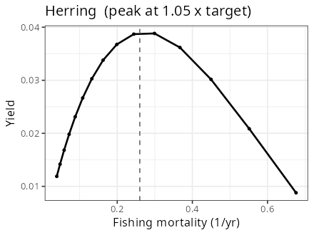
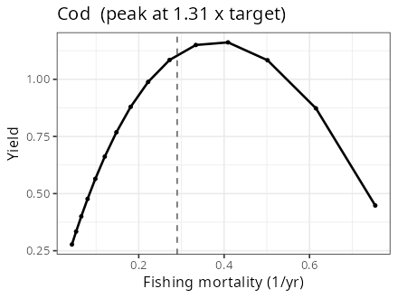
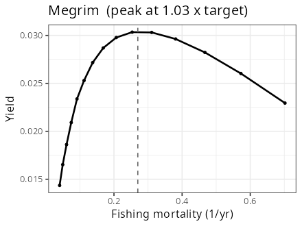
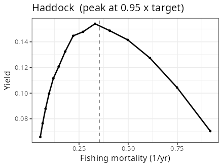
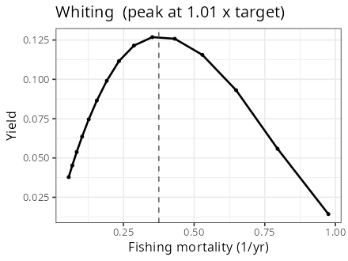
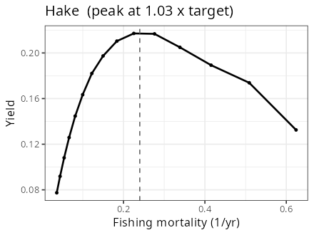
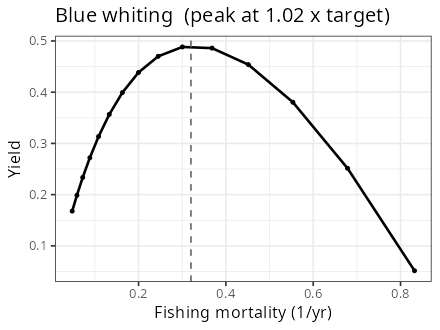
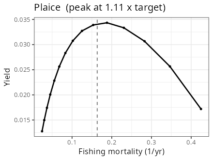
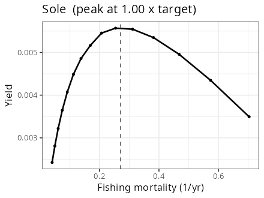

```{r}
#| label: setup
#| message: false
#| warning: false
library(dplyr)
library(ggplot2)
library(mizer)
library(mizerExperimental)
library(mizerEcopath)
library(knitr)

# The data file lives in `inst/`, which is at a different place depending on
# whether this document is rendered from the package root, from `vignettes/`,
# or from an installed copy of the package.
pkg_file <- function(name) {
    for (p in c(name, file.path("inst", name), file.path("..", "inst", name))) {
        if (file.exists(p)) return(p)
    }
    system.file(name, package = "mizerEcopath")
}
```

## What this document is

This document builds a nine-species mizer model of the Celtic Sea from Richard's and Jess's data, in which **each species grows along its own von Bertalanffy curve while in steady state**. It is the counterpart of `vignettes/Richard_and_Jess.qmd`, which builds the same model from the same data but starting from a pure power-law ("allometric") growth model. The data, the fitting machinery and the overall sequence of stages are the same; what differs is the growth model, and — as it turns out — quite a lot of what follows from it.

The build proceeds in stages, each arranged so that it does not destroy what the previous stages achieved:

1.  **Von Bertalanffy scaffolding.** Start from a model in which every species follows its von Bertalanffy growth curve and nothing interacts with anything.
2.  **Fit to size data.** Adjust gear selectivity, catchability, growth diffusion and external mortality so that the steady state reproduces the observed catch and survey size distributions, the observed yield and the observed biomass.
3.  **Add satiation.** Give the fish a finite maximum intake rate without changing their consumption, so the fit from stage 2 survives.
4.  **Give two species more mortality**, because otherwise the diet matrix cannot be imposed.
5.  **Add species interactions** from an observed diet matrix.
6.  **Add the resource**, letting a dynamic plankton spectrum absorb as much as possible of the remaining external food.
7.  **Tune the response knobs** — feeding levels and, where needed, cannibalism — so that each species' yield-versus-fishing-mortality curve can be brought to peak at its $F_{MSY}$.
8.  **Add density dependence.** Choose each species' reproduction level so that the peak actually lands there.

Stages 3, 6, 7 and 8 share a property that makes the whole procedure possible: each changes only how the model *responds* to being perturbed, leaving the steady state — and hence every quantity the earlier stages fitted — exactly where it was. They are invisible to the biomass, the size distributions and the Ecopath ratios, and they are the only things left to choose once those have been matched.

### Why von Bertalanffy

The allometric build pins each species' growth by requiring it to reach `w_mat` at `age_mat`, which fixes one number; the shape of the growth curve is then whatever a power law gives. Here the growth curve is the species' von Bertalanffy curve throughout, so the whole of the `k_vb`/`w_inf`/`t0` information in the data is used rather than just the age at maturity. Three consequences run through the rest of this document:

- **Growth is right by construction.** @fig-growth shows the modelled growth curves lying on top of the von Bertalanffy curves for all nine species. In the allometric model this is a test that the model can pass or fail; here it is an identity that survives all the later stages.
- **The metabolic cost is real rather than invented.** The von Bertalanffy equation in weight is $\mathrm{d}w/\mathrm{d}t = A w^n - B w$, and mizer represents the $-Bw$ term as a genuine metabolic loss. The allometric build has no metabolic cost at all until stage 3 introduces one by choosing a critical feeding level $f_c$; here stage 3 only has to add satiation.
- **The response to food is different, and so is stage 7.** Because $E_r = \alpha C - Bw$ is a *difference*, the elasticity of growth to food, $\mathrm{d}\log E_r/\mathrm{d}\log C = \alpha C/(\alpha C - Bw)$, grows without bound as a fish approaches $w_\infty$. Large fish in this model are much more sensitive to a change in food supply than large fish in the allometric model. @sec-knobs shows that this reverses the sign of two of the tuning knobs relative to the allometric build.

Stages 1 to 7 are run live below. Stage 8 involves several hundred projections to steady state, so its code is shown but not executed and the recorded results are reproduced instead.

## The data

```{r}
#| label: load-data
load(pkg_file("data_Richard_and_Jess.rda"))
```

The file `inst/data_Richard_and_Jess.rda`, produced by `inst/combine_data_from_Richard_and_Jess.R`, contains the species parameters `sp`, the gear parameters `gp` and the size distributions `catch`. It is described in detail in the companion vignette; only what this build depends on is repeated here.

```{r}
#| label: sp-table
sp |>
    select(species, a, b, w_mat, age_mat, w_inf, k_vb, t0,
           biomass_observed, l_max, biomass_cutoff, FMSY) |>
    kable(digits = 3,
          caption = "Life-history and observation parameters.")
```

Three columns matter more here than they do in the allometric build.

`k_vb` and `t0` are used directly rather than only through `age_mat`. `t0` is negative for Whiting ($-1.01$) and Blue whiting ($-2.48$), meaning the von Bertalanffy fish already has a positive size at age 0. Mizer starts every fish at `w_min`, so it cannot follow such a curve below maturity; `newVonBertalanffyParams()` instead speeds up juvenile growth by just enough to reach `w_mat` at the age the von Bertalanffy curve predicts, and reports that it has done so. Above maturity the growth is untouched.

`biomass_cutoff` is the weight of a 20 cm fish: Richard's biomass estimates come from survey catches that do not see fish much below 20 cm, so `biomass_observed` is treated as the biomass above that cutoff.

### The survey gear gets a dome

```{r}
#| label: gears
#| code-fold: show
domed <- c("Megrim", "Blue whiting", "Plaice")
gp$l50_right <- NA_real_
gp$l25_right <- NA_real_
dome_sel <- gp$gear == "survey" & gp$species %in% domed
gp$sel_func[dome_sel] <- "double_sigmoid_length"
l_max_dome <- sp$l_max[match(gp$species[dome_sel], sp$species)]
gp$l50_right[dome_sel] <- 0.75 * l_max_dome
gp$l25_right[dome_sel] <- 0.95 * l_max_dome
```

Every species has two gears: a `survey` gear with catchability $10^{-12}$ and `yield_weight = 0`, which removes no fish and exists only to give the survey size distribution a selectivity curve of its own, and a `commercial` gear that carries the observed yield.

For Megrim, Blue whiting and Plaice the observed *survey* distribution falls away at large sizes more steeply than any rising sigmoid can produce, so the fit is forced to blame the shortfall on the size spectrum and gets both wrong. Giving those three survey gears a dome-shaped (`double_sigmoid_length`) selectivity fixes it, and it is a change to the observation model only: with catchability $10^{-12}$ the survey gear has no effect whatever on the dynamics. @sec-dome reports what it buys and why the *commercial* selectivity is left monotone.

## Stage 1: the von Bertalanffy starting model

```{r}
#| label: vonBert
#| code-fold: show
#| message: false
#| warning: false
p <- newVonBertalanffyParams(sp)
gear_params(p) <- gp
initial_effort(p) <- 1

p <- steadySingleSpecies(p) |>
    setBevertonHolt()
p <- matchBiomasses(p)
```

`newVonBertalanffyParams()` builds a model in which, for each species,

- the energy income is a pure power law $\alpha E = A w^n$ with $n = 1 - 1/b \approx 0.68$, $A = b\,k_{vb}\,w_\infty^{1/b}$,
- the metabolic loss is linear, $B w$ with $B = b\,k_{vb}$, so that the net energy is exactly the von Bertalanffy rate $\mathrm{d}w/\mathrm{d}t = A w^n - B w$,
- maximum intake is infinite ($h = \infty$), so there is no satiation,
- species do not interact, either with each other or with the resource: all food is "external",
- the natural mortality is a power law $\mu_i(w) = z_{\text{ext},i} w^{n-1}$ with the coefficient chosen so that the juvenile biomass spectrum has slope $-0.2$,
- the reproduction level is zero.

One subtlety is worth naming because it is what makes the scheme work at all. Mizer splits the surplus energy into somatic growth and reproduction, $g = (1-\psi)(\alpha E - \text{metab})$, so if we want the *somatic* growth to be the von Bertalanffy rate the surplus must be $g_{vb}/(1-\psi)$. `newVonBertalanffyParams()` achieves that by *reducing* the metabolic loss by $\psi/(1-\psi)\,g_{vb}$. Because `w_repro_max` is set to `w_inf`, this reduction never exceeds the metabolic loss, so respiration stays non-negative — and mature fish fund both growth and reproduction out of income alone.

As in the allometric build, nothing interacts at this stage, so each species can be solved independently and put exactly where we want it.

## Stage 2: matching the size distributions

### Anchoring the mortality

```{r}
#| label: production-anchor
#| code-fold: show
species_params(p)$production_observed <- getSomaticProduction(p)
```

The fit is free to change the external mortality coefficient `z_ext`, and with only size distributions and a yield to constrain it, it can wander a long way from anything sensible. In steady state mortality and production are two sides of the same coin — what a cohort produces in new tissue is what mortality removes — so we constrain mortality indirectly by asking the optimiser to keep production near the value the default model already has. This is a regularisation term, not an observation.

### The fit

```{r}
#| label: matchCatch
#| code-fold: show
#| message: false
#| warning: false
pm <- matchCatch(p, catch = catch)
```

`matchCatch()` adjusts, per species, the selectivity parameters of both gears, the catchability of the commercial gear, the growth-diffusion coefficient `D_ext` and the external mortality coefficient `z_ext`, minimising the negative log likelihood of the observed catch size distributions plus squared log-differences in yield and in production. Selectivity and mortality have to be fitted together because the predicted catch distribution is the product of the selectivity curve and the size spectrum, and the spectrum is itself shaped by the balance of growth and mortality. The objective is written in C++ and differentiated by TMB, which is what makes a joint fit practical. Crucially it takes the *energy available for growth and reproduction as given data*, so the von Bertalanffy growth curve of stage 1 is untouched.

### How well does it fit? {#sec-dome}

```{r}
#| label: nll-fn
# Multinomial negative log likelihood of the observed catch size distributions
# given the model, per species and gear, reported as an excess over the
# saturated (best possible) value and divided by the number of fish so that it
# is comparable across species and across models.
catch_nll <- function(params, catch) {
    sp <- species_params(params)
    fm <- getFMortGear(params)
    out <- NULL
    for (i in seq_len(nrow(sp))) {
        s <- sp$species[i]
        w <- w(params); dw <- dw(params)
        for (g in unique(catch$gear[catch$species == s])) {
            obs <- catch[catch$species == s & catch$gear == g &
                             !is.na(catch$catch), ]
            if (nrow(obs) == 0) next
            cw <- fm[g, i, ] * initialN(params)[i, ]
            edges <- sp$a[i] * c(obs$length, max(obs$length + obs$dl))^sp$b[i]
            cum <- c(0, cumsum(cw * dw))
            lo <- w[1] - dw[1] / 2; hi <- max(w + dw / 2)
            F_at <- approx(c(lo, w + dw / 2), cum,
                           xout = pmin(pmax(edges, lo), hi), rule = 2)$y
            prob <- diff(F_at); prob <- prob / sum(prob)
            k <- obs$catch
            phat <- k / sum(k)
            out <- rbind(out, data.frame(
                species = s, gear = g, n = sum(k),
                excess = (-sum(k * log(pmax(prob, 1e-12))) +
                              sum(k[k > 0] * log(phat[k > 0]))) / sum(k)))
        }
    }
    out
}
nll <- catch_nll(pm, catch)
```

The fit is good: the excess negative log likelihood per fish, averaged over all species and gears, is `r round(weighted.mean(nll$excess, nll$n), 4)`.

```{r}
#| label: nll-table
nll |> arrange(gear, species) |>
    mutate(excess = round(excess, 4)) |>
    kable(row.names = FALSE,
          caption = "Excess negative log likelihood per fish. Zero would be a perfect fit to the raw 1 cm bins.")
```

That number is worth putting in context, because it is the one place where this build can be compared with the allometric one on equal terms. Rebuilding stages 1 and 2 four ways gives:

| Starting model | Survey selectivity | Commercial selectivity | Mean excess NLL per fish |
|------------------|------------------|------------------|-------------------:|
| Allometric | sigmoid | sigmoid | 0.1926 |
| von Bertalanffy | sigmoid | sigmoid | 0.1671 |
| von Bertalanffy | dome (all nine) | sigmoid | 0.0595 |
| von Bertalanffy | dome (all nine) | dome | 0.0533 |

Two things follow. First, with the selectivity structure of the allometric build held fixed, the von Bertalanffy model fits the size distributions *better* (0.167 against 0.193) — the extra growth information helps rather than costing anything. Second, most of the remaining misfit was never about growth at all: it was the survey gear, and three species carried almost all of it. Doming their survey selectivity takes Blue whiting's survey misfit from 0.685 to 0.096, Megrim's from 0.056 to 0.004 and Plaice's from 0.310 to 0.059; the other six species gain nothing measurable, which is why only those three are domed.

Doming the *commercial* gear as well buys a further 0.006 and is not worth having. It fits Herring a 2 cm wide knife-band ($l_{50} = 25.8$, $l_{25\text{-right}} = 27.7$ cm) and nearly triples Herring's and Blue whiting's fitted catchability. Unlike the survey gear, the commercial selectivity *is* the fishing mortality, so an artefact there propagates into every yield curve in stage 8.

A side benefit of the dome: Blue whiting's `z_ext` comes off the optimiser's lower bound of 0.2 and settles at 2.85, because its mortality is no longer being asked to explain a shape that the selectivity should have explained.

## Stage 3: satiation {#sec-satiation}

```{r}
#| label: feeding-level
#| code-fold: show
#| message: false
#| warning: false
pm <- setFeedingLevel(pm, feeding_level = 0.6)
```

So far the fish have infinite maximum intake, so they eat in strict proportion to the food available. `setFeedingLevel()` gives each species a size-independent feeding level $f$ — the fraction of its maximum rate at which it eats — by lowering $h$ and raising the encounter rate together:

$$h(w) = \frac{1-f}{f}\,E'(w), \qquad E' = \frac{1-f_{\text{old}}}{1-f}\,E,$$

which leaves the consumption $(1-f)E$ exactly unchanged. Growth, the size spectrum, the biomass, $Q/B$ and the respiration are therefore all exactly where stage 2 left them.

Note what this stage does *not* have to do. The allometric build has no metabolic cost at all until this point, and has to manufacture one by choosing a critical feeding level $f_c$ below which growth stops; the level of $f$ then has to be traded off against $f_c$ to keep $Q/B$ and respiration fixed. Here respiration is already the $Bw$ term of the von Bertalanffy equation, and $f$ is free on its own.

What the feeding level *does* change is the elasticity of consumption to food,

$$\frac{\mathrm{d}\log C}{\mathrm{d}\log E} = 1 - f,$$

and hence how strongly growth responds when competitors are fished away. A fish close to satiation barely notices. This is the first of the response-only knobs, and @sec-knobs returns to it — with a surprise about which direction it pushes.

## Stage 4: mortality enough to carry the diet matrix {#sec-stage4}

If we go straight on to imposing the diet matrix, two species object:

```{r}
#| label: diet-diagnostic
#| code-fold: show
#| warning: true
pd <- matchDiet(pm, reduced_dm)
```

Imposing the diet matrix converts part of the anonymous external mortality into explicit predation mortality. If the diet matrix implies more predation on a species than that species' total mortality in the current model, external mortality would have to go negative to balance the books. Here Cod and Hake are in that position. That is already gentler than in the allometric build, which had three such species and needed much larger changes (Herring's production forced to 0.8, Cod's to 0.1, Hake's to 0.8): the von Bertalanffy model starts closer to being able to carry the diet matrix.

For **Hake** we do the conventional thing and give it more total mortality, which — by the steady-state identity of stage 2 — means asking for more production. A factor of 1.5, found by scanning upwards until the warning disappeared, is enough:

```{r}
#| label: production-fix
#| code-fold: show
#| message: false
#| warning: false
species_params(pm)["Hake", "production_observed"] <-
    1.5 * species_params(pm)["Hake", "production_observed"]
pm <- matchCatch(pm, catch = catch, species = "Hake")
```

For **Cod** we do something different, and the reason belongs here rather than in stage 8 even though that is where the payoff is. Nothing else in the model eats Cod, so the whole of the excess demand is cannibalism. We can either inflate Cod's mortality to accommodate the Ecopath cannibalism entry, or keep Cod's fitted mortality and weaken the entry. The second is better on both counts: Cod's mortality stays where the size distributions and the production anchor put it, *and* Cod's yield peak in stage 8 comes out lower, which is the direction it needs to move.

```{r}
#| label: cannibalism
#| code-fold: show
lambda_cod <- 0.2
dm <- reduced_dm
dm["Cod", "other"] <- dm["Cod", "other"] + (1 - lambda_cod) * dm["Cod", "Cod"]
dm["Cod", "Cod"]   <- lambda_cod * dm["Cod", "Cod"]
```

The multiplier 0.2 is close to the best available, and the scan behind it is worth showing because it is not monotone. `codClip` records whether Cod's external mortality still had to be clipped at zero, and `max |dB|` the largest relative biomass mismatch over all nine species:

| $\lambda_\text{Cod}$    |    0 |      0.2 |  0.3 |  0.4 | 1.0 (+1.5× production) |
|-------------------------|-----:|---------:|-----:|-----:|-----------------------:|
| Cod peak / $F_{MSY}$    | 1.76 | **1.45** | 1.38 | 1.38 |                   1.60 |
| Cod's mortality clipped |   no |       no |  yes |  yes |                     no |
| max \|dB\|              | 0.03 |     0.03 | 0.03 | 0.03 |                   0.03 |

Below 0.2 the peak rises steeply, because the cannibalism mortality on juvenile Cod is what makes Cod's yield curve turn over at all. Above 0.25 the clipping returns, so the model no longer honours the fitted mortality. The allometric build ends up making the *opposite* trade — it takes cannibalism down to $\lambda = 0.1875$ at stage 7 because there weakening cannibalism is what brings Cod's peak *down*. In the von Bertalanffy model the sign is reversed, and @sec-knobs collects the other places where that happens.

The honest summary is the same in both builds, though: Cod's cannibalism is 1.2% of its diet by mass but supplies a large share of the mortality on small Cod, and we are trading the diet entry — which Ecopath reports — against the $F_{MSY}$ estimate.

## Stage 5: species interactions from the diet matrix

```{r}
#| label: matchDiet
#| code-fold: show
#| message: false
#| warning: false
pd <- matchDiet(pm, dm)
ps <- steady(pd, tol = 1e-10)
```

`matchDiet()` converts the diet proportions of `reduced_dm` into absolute consumption rates using each predator's consumption rate, solves for the interaction matrix $\theta_{ij}$ that reproduces them, and applies it — turning down external encounter and external mortality by exactly the corresponding amounts, so that the total food each predator gets and the total mortality each prey suffers are unchanged. The steady state survives; what changes is the *attribution* of food and mortality from anonymous external terms to named species.

Residual warnings about negative external *encounter* (Megrim, Whiting, Hake) are clipped at zero: for these the diet matrix says they get more food from the modelled species than the model gives them in total. This affects only a small number of large individuals, but it is why `steady()` is called afterwards. Biomass moves by at most 1.3% and consumption by at most 1.8%.

## Stage 6: the plankton resource

```{r}
#| label: resource
#| code-fold: show
#| message: false
#| warning: false
psr <- alignResource(ps)
resource_params(psr)$w_pp_cutoff <- 1
initialNResource(psr)[w_full(psr) > 1] <- 0
comment(psr@cc_pp) <- NULL
psr <- setResourceInteraction(psr,
                              resource_dynamics = "resource_semichemostat",
                              tol = 1e-2)
psr <- steady(psr, tol = 1e-10)
resource_level(psr) <- 0.5
psr <- steady(psr, tol = 1e-12, t_max = 200)
```

`alignResource()` sets the resource to a power law $\kappa w^{-\lambda}$ with $\kappa$ chosen so that it is tangent to the total fish abundance spectrum from above — the smallest resource abundance that still sits everywhere above the fish. The resource is then cut off at 1 g, which is both realism about what counts as plankton and what makes the next step work: a large predator then gets a negligible fraction of its food from the resource, so its large individuals stop constraining how much resource interaction it is allowed to have.

`setResourceInteraction()` lets each species absorb as much of its remaining external encounter as it can into genuine feeding on the resource, adjusting the carrying capacity so that the resource abundance, and hence the steady state, is unchanged.

Finally the resource is given semichemostat dynamics and a resource level of 0.5. Setting the resource level does not move the resource — `setResource()` adjusts the carrying capacity and the replenishment rate together — it sets how hard the resource pushes back. From the semichemostat balance $N_R = c_R r/(r+\mu)$,

$$\frac{\mathrm{d}\log N_R}{\mathrm{d}\log\mu} = -\frac{\mu}{r+\mu}
  = -\left(1 - \texttt{resource\_level}\right),$$

the same linear form as the feeding-level elasticity of @sec-satiation. This is the second response-only knob.

How much work it can do depends on how much of each species' food is actually resource:

```{r}
#| label: food-shares
dm <- getDietMatrix(psr)
fish <- rowSums(dm[species_params(psr)$species, species_params(psr)$species])
data.frame(species = species_params(psr)$species,
           fish = round(fish / rowSums(dm[species_params(psr)$species, ]), 3),
           resource = round(dm[species_params(psr)$species, "Resource"] /
                                rowSums(dm[species_params(psr)$species, ]), 3),
           external = round(dm[species_params(psr)$species, "External"] /
                                rowSums(dm[species_params(psr)$species, ]), 3)) |>
    kable(row.names = FALSE,
          caption = "Where each species' food comes from, as a fraction of its total consumption. Only the `fish` and `resource` columns can respond to fishing; `external` is a fixed background.")
```

The model at this point is a genuine steady state: projected forward 20 years, no species' biomass moves by more than $10^{-11}$ relative.

## Stage 7: the response knobs {#sec-knobs}

Stage 8 chooses each species' reproduction level so that its yield curve peaks at its $F_{MSY}$. For some species the reproduction level runs out before it gets there, and this stage supplies the extra knobs. It also, unavoidably, is where the von Bertalanffy model behaves least like the allometric one.

### A feeding-level knob that works after the interactions are in place

`setFeedingLevel()` in @sec-satiation requires all encounter to be external, so it can only be used before stage 5. That is inconvenient: retuning a feeding level would mean rebuilding the model from stage 3. There is a version that works on the finished model:

```{r}
#| label: f-knob
#| code-fold: show
setFeedingLevelInteracting <- function(params, f_new) {
    f_old <- getFeedingLevel(params)
    sp <- species_params(params)$species
    if (is.null(names(f_new))) names(f_new) <- sp
    for (s in names(f_new)) {
        i <- match(s, sp)
        cc <- (1 - f_old[i, ]) / (1 - f_new[[s]])
        sv <- search_vol(params); sv[i, ] <- sv[i, ] * cc
        search_vol(params) <- sv
        ee <- ext_encounter(params); ee[i, ] <- ee[i, ] * cc
        ext_encounter(params) <- ee
        E <- getEncounter(params)
        im <- intake_max(params)
        im[i, ] <- E[i, ] * (1 - f_new[[s]]) / f_new[[s]]
        intake_max(params) <- im
    }
    params
}
```

Multiply the predator's search volume **and** its external encounter rate — the two additive parts of mizer's encounter rate — by $c = (1-f)/(1-f')$, and set its maximum intake so that the new feeding level is $f'$. Then the encounter rate becomes $cE$, so

$$\text{consumption}' = (1-f')\,cE = (1-f)\,E,$$

unchanged; and because a predator's consumption of prey $j$ and the predation mortality it inflicts on $j$ both carry the same factor $(1-f)\times(\text{search volume})$, both of those are unchanged too. Nothing in the steady state moves, the diet matrix does not move, and the prey do not notice. What moves is only the elasticity $\mathrm{d}\log C/\mathrm{d}\log E = 1-f$.

Checked against the stage 6 model with $f$ set to 0.9 for Cod and 0.2 for Blue whiting, the energy for growth and reproduction, the consumption and the diet matrix all agree to machine precision ($\le 3\times10^{-13}$ relative), the predation mortality to $2\times10^{-10}$, and projecting 20 years moves no biomass by more than $7\times10^{-12}$.

### Which way do the knobs push?

With that in hand we can measure each knob against the criterion. The table gives the *side* diagnostic — the relative difference between the yield 25% above and 25% below the target, so positive means the peak lies above the target — at the reproduction floor:

| $f$     |  0.03 |  0.10 |  0.25 |  0.40 |  0.60 |   0.75 |   0.85 |   0.92 |   0.96 |
|---------|------:|------:|------:|------:|------:|-------:|-------:|-------:|-------:|
| Cod     | 0.069 | 0.083 | 0.109 | 0.132 | 0.155 |  0.174 |  0.189 |  0.202 |  0.209 |
| Hake    | 0.152 | 0.170 | 0.204 | 0.233 | 0.271 |  0.407 |  0.679 |  0.821 |  0.781 |
| Whiting | 0.243 | 0.235 | 0.210 | 0.168 | 0.075 | −0.036 | −0.123 | −0.188 | −0.225 |

**Whiting behaves as the allometric build's whiting does**, at least at first: raising $f$ lowers its peak, because a fish near satiation grows less when its competitors are fished away, and that food-mediated growth response is what was holding the peak up.

**Cod and Hake go the other way.** For them the food-web feedback near $F_{MSY}$ is *depensatory* rather than compensatory: making the web more responsive — lowering $f$, or strengthening cannibalism as in @sec-stage4 — pushes the peak *down*. This is the clearest single behavioural difference from the allometric model, and it traces back to the shape of $E_r$. In the allometric build the surplus energy is a clean power law and the growth response to food is $(1-f)/(1-f_c/f)$ everywhere. Here

$$\frac{\mathrm{d}\log E_r}{\mathrm{d}\log C} = \frac{\alpha C}{\alpha C - Bw}$$

blows up as a fish approaches $w_\infty$, because $E_r$ is a small difference of two large numbers there. The largest individuals — exactly the ones that carry the yield — are hypersensitive to food, and that changes the sign of the net loop.

There is a second lesson in this table, and it cost more time than the first: **these sensitivities are not properties of a species, they are properties of the whole model state.** Every number above was measured with the other eight species at the reproduction floor. Once stage 8 has given them their tuned reproduction levels, Whiting's response to $f$ collapses to nothing (its peak moves from 1.35 to 1.32 as $f$ goes from 0.80 to 0.98) and Hake needs no help at all. Only Herring's response to $f$ survives the change of state, and it is dramatic:

| $f$ (Herring)    | 0.80 | 0.90 |   0.94 | 0.95 | 0.98 |
|------------------|-----:|-----:|-------:|-----:|-----:|
| peak / $F_{MSY}$ | 2.60 | 1.41 | *used* | 0.92 | 0.68 |

Herring takes 96% of its food from the resource — by far the most responsive diet in the model — which is why its peak sits at 2.6 times its $F_{MSY}$ at $f = 0.6$ and why damping the response works so well.

```{r}
#| label: apply-f
#| code-fold: show
f <- setNames(rep(0.6, 9), species_params(psr)$species)
f[["Herring"]] <- 0.94
psr <- setFeedingLevelInteracting(psr, f)
```

### What Cod and Whiting need instead

Measured on the model with the stage-8 reproduction levels in place, the feeding level and the resource level do nothing for Cod or Whiting; what does move them is their predation on the other modelled fish. The tool is a generalisation of the allometric build's cannibalism reallocation from the diagonal of the interaction matrix to an arbitrary block of it:

```{r}
#| label: link-knob
#| code-fold: show
set_link <- function(params, pred, prey, lambda) {
    mort_old <- getPredMort(params)
    enc_old  <- getEncounter(params)
    inter <- interaction_matrix(params)
    inter[pred, prey] <- inter[pred, prey] * lambda
    interaction_matrix(params) <- inter
    # Encounter first: predation mortality carries a factor (1 - f) and so
    # depends on the encounter rate. Restoring the mortality first would bake a
    # spurious external mortality into every prey species.
    ext_encounter(params) <- ext_encounter(params) +
        (enc_old - getEncounter(params))
    ext_mort(params) <- ext_mort(params) + (mort_old - getPredMort(params))
    params
}
```

Weaken the entries `inter[pred, prey]` and hand back what that removes: the lost food to the predators' external encounter, the lost predation mortality to the prey's external mortality. Growth, mortality, the spectra and the catch size distributions are all left exactly where they were; what changes is that the reallocated part of the food web can no longer respond to fishing. Applied to a whole row, it gives:

| $\lambda$ applied to the row |  0.0 |  0.5 | 0.55 | 0.65 | 0.75 | 0.85 |  1.0 |
|------------------------------|-----:|-----:|-----:|-----:|-----:|-----:|-----:|
| Cod, peak / $F_{MSY}$        | 1.00 | 1.36 |      |      |      |      | 1.49 |
| Whiting, peak / $F_{MSY}$    | 0.21 |      | 0.87 | 0.94 | 1.04 | 1.18 | 1.37 |

(on the cheap grid; @sec-peaks gives the accurate values). Whiting needs only a mild reduction, and $\lambda = 0.65$ is used. Cod needs nearly all of it, and @sec-cod is devoted to why that still is not enough.

```{r}
#| label: apply-links
#| code-fold: show
allsp <- species_params(psr)$species
psr <- set_link(psr, "Whiting", allsp, 0.65)
psr <- set_link(psr, "Cod", allsp, 0.01)
```

### Knobs that turn out not to help

The **resource level** was scanned over $\{0.05, 0.25, 0.5, 0.75\}$. It moves Whiting and Blue whiting appreciably in the same direction as $f$ but barely touches Cod (side 0.143 at 0.05 against 0.203 at 0.75, and Cod's *peak* ratio is unchanged at 1.57–1.61 across the whole range), so it is left at 0.5 and the per-species knobs are used instead.

**Strengthening cod's cannibalism beyond its Ecopath value** ($\lambda > 1$ in the reallocation of @sec-stage4) would push Cod's peak further down, but it is infeasible: paying for the extra cannibalism out of external mortality and external encounter drives both negative already at $\lambda = 3$.

**Lowering Cod's external mortality** below the `matchCatch()` floor of 0.2 does lower its peak (1.45 → 1.27 at `z_ext = 0.03`) at no cost in size-distribution fit — but it then leaves Cod's mortality too small to carry even the weakened cannibalism, so `matchDiet()` clips it and the biomass mismatch grows from 3% to 11%. Not worth it.

**Raising the resource cutoff** above 1 g, to give the larger fish a responsive food source, was tried at 10, 30 and 100 g. It does not help the species that need it — Blue whiting's resource share barely moves (0.397 → 0.407) — and it makes the allocation erratic for others (Megrim's resource share collapses from 0.488 to 0.025). The cutoff stays at 1 g.

## Stage 8: reproduction levels {#sec-repro}

The reproduction level controls how strongly reproduction is buffered against changes in spawning stock: 0 means recruitment is proportional to spawning stock, 1 means it is insensitive to it. It cannot be read off the data but has a large effect on how the model responds to fishing — the more density dependence, the higher $F_{MSY}$.

The criterion is that the maximum of each species' yield-versus-$F$ curve should sit at that species' $F_{MSY}$, from the `FMSY` column of `sp`. Plaice has no $F_{MSY}$, and for it we fall back to the fishing mortality the model says it currently experiences.

### The two-point test is not safe here

The allometric build locates the peak cheaply: to know which way to move the reproduction level you only need to know which *side* of the peak the target is on, which takes two projections rather than a whole curve. That argument assumes the yield curve is unimodal, and in this model several are not. Blue whiting's is the clearest case — at the reproduction ceiling it has a maximum at low $F$, a minimum close to its $F_{MSY}$, and a second rise beyond, so the local slope at the target points the wrong way even though the global maximum is far above it:

| $F/F_{MSY}$    |  0.20 |  0.27 |  0.37 |  0.49 |  0.67 |  0.90 |  1.22 |  1.64 |  2.22 |  3.00 |
|-------|------:|------:|------:|------:|------:|------:|------:|------:|------:|------:|
| yield (scaled) | 0.949 | 0.462 | 0.438 | 0.480 | 0.549 | 0.635 | 0.730 | 0.826 | 0.918 | 1.000 |

Following the two-point test here would have concluded that Blue whiting's peak lies *below* its target at every reproduction level, when in fact it moves from below the target at the floor to above it at the ceiling, and a bracket exists. Cod's curve is unimodal, and Hake's has two local maxima whose global winner switches with the reproduction level.

`inst/tune_repro_level_vB.R` therefore evaluates a whole curve on a log grid of multiples of the target, takes its global maximum with a quadratic refinement in $\log F$, and bisects the reproduction level on $\log(F_\text{peak}/F_{MSY})$ in the variable $u = -\log(1-r_l)$. Tuning one species shifts the curves of the others, so the sweep is iterated; the sweeps are run as a parallel Jacobi iteration (all nine species tuned from the same starting point, then all the reproduction levels applied at once) because a sequential sweep takes several hours.

### The sweep

```{r}
#| label: repro-sweep
#| eval: false
#| code-fold: show
source(pkg_file("tune_repro_level_vB.R"))

Ft <- F_targets(psr)
params <- psr
for (sweep in 1:3) {
    res <- parallel::mclapply(names(Ft), function(s) {
        r <- tune_peak(params, s, Ft[[s]], steps = 7, tol = 0.10)
        r$species <- s
        r
    }, mc.cores = 6)
    for (r in res) params <- set_rl(params, r$species, r$rl)
}
```

The iteration is stable: sweeps 2 and 3 give identical reproduction levels.

| Species      | $r_l$ | status         |
|--------------|------:|----------------|
| Herring      | 0.167 | converged      |
| Cod          | 0.005 | at lower bound |
| Megrim       | 0.907 | converged      |
| Haddock      | 0.851 | converged      |
| Whiting      | 0.005 | at lower bound |
| Hake         | 0.381 | converged      |
| Blue whiting | 0.761 | converged      |
| Plaice       | 0.761 | converged      |
| Sole         | 0.761 | converged      |

Cod and Whiting sit at the floor, meaning their peaks are still above target and the reproduction level has nothing left to give. A reproduction level of 0.005 asserts that recruitment is essentially proportional to spawning stock, which is a strong claim made because the yield-peak criterion demands it rather than because anything supports it.

### Where the peaks end up {#sec-peaks}

The tuning above uses a deliberately cheap yield curve (7 grid points, `tol = 0.01`, `t_max = 60`). The peaks are therefore recomputed afterwards on a finer grid with a much tighter convergence tolerance (15 points, `tol = 10^{-3}`, `t_max = 200`), and *that* is the number to quote:

```{r}
#| label: validate
#| eval: false
#| code-fold: show
MULT <- exp(seq(log(0.15), log(2.6), length.out = 15))
for (s in names(Ft)) {
    y <- getYieldVsF(params, s, gear = "commercial", F_range = Ft[[s]] * MULT,
                     tol = 1e-3, t_max = 200)
    print(peak_ratio(y[order(y$F), ], Ft[[s]]))
}
```

| Species | $F_\text{target}$ | $F_\text{peak}$ | $F_\text{peak}/F_\text{target}$ |
|-----------------------|----------------:|----------------:|----------------:|
| Herring | 0.2600 | 0.2729 | 1.05 |
| **Cod** | 0.2900 | 0.3792 | **1.31** |
| Megrim | 0.2700 | 0.2779 | 1.03 |
| Haddock | 0.3530 | 0.3339 | 0.95 |
| Whiting | 0.3750 | 0.3771 | 1.00 |
| Hake | 0.2400 | 0.2468 | 1.03 |
| Blue whiting | 0.3200 | 0.3250 | 1.02 |
| Plaice | 0.1634 | 0.1807 | 1.11 |
| Sole | 0.2705 | 0.2713 | 1.00 |

Eight of the nine sit within 11% of their target, and six within 5%. The discrepancy between the cheap and the accurate evaluation is under 0.06 for every species except Cod, where it is 0.24 — Cod is the longest-lived species in the model and 60 years is simply not long enough for it to re-equilibrate.

::: {#fig-yieldcurves layout-ncol="3"}
{fig-alt="Yield curve for Herring, peaking on its target."}

{fig-alt="Yield curve for Cod, peaking above its target."}

{fig-alt="Yield curve for Megrim, peaking on its target."}

{fig-alt="Yield curve for Haddock, peaking just below its target."}

{fig-alt="Yield curve for Whiting, peaking on its target."}

{fig-alt="Yield curve for Hake, peaking on its target."}

{fig-alt="Yield curve for Blue whiting, peaking on its target."}

{fig-alt="Yield curve for Plaice, peaking just above its target."}

{fig-alt="Yield curve for Sole, peaking on its target."}

Yield against fishing mortality for each species in the final model, on the accurate grid. The dashed line marks the target: $F_{MSY}$, or for Plaice the fitted current $F$.
:::

Every curve is flat near its maximum, so the ratios in the table overstate how much is at stake. Even for Cod, fishing at $F_{MSY}$ rather than at the model's own peak costs about 7% of the yield. The criterion pins the reproduction level far less tightly than the tabulated ratios suggest.

### Cod: where the two criteria collide {#sec-cod}

Cod is the one species for which fitting the data and putting the yield peak at $F_{MSY}$ are genuinely in conflict, and it is worth setting out why, because the conflict is arithmetic rather than a failure of tuning.

Richard's data put Cod's current fully-selected fishing mortality at 0.878/yr — **three times** its ICES $F_{MSY}$ of 0.29. The model is calibrated to be in *equilibrium* there. With the reproduction level at its floor the stock sits essentially at replacement, so the fishing mortality at which it would collapse is the fitted $F$ itself, and the yield peak lands at a fixed fraction of that, set by the fitted spectrum, the fitted selectivity and the growth curve. That fraction is about 0.43 here, giving a peak at 0.38; the target needs 0.33.

No response-only knob moves it. Decoupling Cod completely from the food web — no predation on any modelled species, no cannibalism, its resource feeding made inert, so that literally none of its food or mortality can respond to fishing — still leaves the peak at 1.26:

| Cod configuration | peak / $F_{MSY}$ | fish share of Cod's diet |
|----|---:|---:|
| full Ecopath predation ($\lambda = 1$) | 1.73 | 0.178 |
| $\lambda = 0.5$ | 1.51 | 0.089 |
| $\lambda = 0.2$ | 1.42 | 0.036 |
| $\lambda = 0.05$ | 1.35 | 0.009 |
| $\lambda = 0.01$ (used) | **1.29** | **0.002** |
| $\lambda = 0$, resource inert too | 1.26 | 0.000 |

The knob is worth using — it takes the peak from 1.73 to 1.29 — but it cannot close the gap, and it is the largest concession in the build: Cod's predation on the other eight modelled species, 17.8% of its consumption, is reallocated to anonymous external mortality on them. The prey still experience the same total mortality; what is lost is the attribution, and with it Cod's row of the diet matrix.

The only lever that does reach the target is Cod's **selectivity**, and the data pays for it:

| Cod commercial $l_{50}$ (cm)        | 58.3 (fitted) |     52 |     46 |     40 |
|-------------------------------------|--------------:|-------:|-------:|-------:|
| fitted $F$                          |         0.878 |  0.745 |  0.654 |  0.589 |
| peak / $F_{MSY}$                    |          1.29 |   1.11 |   0.96 |   0.86 |
| Cod's commercial catch NLL per fish |         0.136 |  0.189 |  0.305 |  0.454 |
| mean NLL over all species and gears |        0.0663 | 0.0663 | 0.0664 | 0.0665 |

Fishing Cod 6 cm smaller than the fit says brings the peak to 1.11, and 12 cm smaller brings it to 0.96. Because Cod contributes only about 1900 of the roughly 1.06 million fish in the size data, the *mean* misfit barely notices — but Cod's own catch distribution does: the $l_{50} = 52$ variant is worse by about 100 log-likelihood units on Cod's commercial distribution, so the size data does not support it.

Two models are therefore saved, and it is worth being explicit that they are the two horns of the same dilemma rather than a good and a bad model.

`inst/params_vB_final_Richard_and_Jess.rds` keeps the fitted selectivity. It is the better fit to the size data, and eight of its nine species peak within 11% of their $F_{MSY}$ while Cod peaks at 1.31.

`inst/params_vB_l50_variant_Richard_and_Jess.rds` fixes Cod's commercial $l_{50}$ at 52 cm (and $l_{25}$ at 45 cm), holds them out of the stage-2 fit, and repeats stages 4 to 8 unchanged. Retuning the reproduction levels for it gives **all nine species within 9%** of their targets:

| Species | Herring | Cod | Megrim | Haddock | Whiting | Hake | Blue whiting | Plaice | Sole |
|--------|-------:|-------:|-------:|-------:|-------:|-------:|-------:|-------:|-------:|
| peak / target | 1.03 | 1.08 | 1.03 | 0.96 | 1.01 | 1.01 | 1.01 | 0.98 | 1.00 |
| $r_l$ | 0.167 | 0.005 | 0.907 | 0.851 | 0.005 | 0.381 | 0.761 | 0.696 | 0.761 |

Which is preferable depends on whether one trusts Richard's Cod catch-at-length more than the ICES $F_{MSY}$ for Cod, and that is not a question the model can answer. If the model is to be used to say anything about Cod at fishing mortalities near $F_{MSY}$, the variant is the one to use, with the caveat that its Cod selectivity is asserted rather than fitted.

## The resulting model

```{r}
#| label: final-model
#| code-fold: show
#| message: false
#| warning: false
params <- setBevertonHolt(psr, reproduction_level = c(
    Herring        = 0.1673, Cod     = 0.0050, Megrim = 0.9073,
    Haddock        = 0.8510, Whiting = 0.0050, Hake   = 0.3811,
    `Blue whiting` = 0.7605, Plaice  = 0.7605, Sole   = 0.7605))
```

The final model is the stage-7 model built above plus the reproduction levels from @sec-repro. It is saved in `inst/params_vB_final_Richard_and_Jess.rds`.

```{r}
#| label: check-steady
#| message: false
#| warning: false
sim <- project(params, t_max = 20, progress_bar = FALSE)
data.frame(species = species_params(params)$species,
           reproduction_level = round(getReproductionLevel(params), 4),
           `biomass drift over 20 yr` =
               signif(getBiomass(sim)[21, ] / getBiomass(sim)[1, ] - 1, 2),
           check.names = FALSE) |>
    kable(row.names = FALSE,
          caption = "Reproduction levels of the final model, and a check that it is a steady state.")
```

### Biomass and yield

```{r}
#| label: fig-biomass
#| fig-cap: "Modelled versus observed biomass."
plotBiomassVsSpecies(params)
```

```{r}
#| label: fig-yield
#| fig-cap: "Modelled versus observed yield."
plotYieldVsSpecies(params)
```

These are the two quantities the calibration targeted directly, so agreement here is a check that nothing in stages 3 to 8 disturbed the fit rather than a test of the model. The largest biomass mismatch is 2.9% and the largest yield mismatch 4.8%; both come from the residual clipping in stage 5, and both are identical in the $l_{50}$ variant of @sec-cod.

### The fit to the size distributions

The red curve is the model's predicted catch size distribution, the blue the observed one, and the grey the modelled abundance, which shows how much of the shape of the catch is selectivity and how much the underlying size structure.

```{r}
#| label: fig-catchdist
#| fig-cap: "Observed and modelled size distributions, commercial gear (left) and survey gear (right)."
#| layout-ncol: 2
#| fig-width: 6
#| fig-height: 3.6
#| message: false
#| warning: false
for (s in c("Cod", "Megrim", "Blue whiting")) {
    for (g in c("commercial", "survey")) {
        print(plotYieldVsSize(params, species = s, gear = g,
                              catch = catch, x_var = "Length"))
    }
}
```

Cod is shown because it is the worst fit and the species discussed in @sec-cod; Megrim and Blue whiting because they are two of the three whose survey gear is domed, and the improvement is visible.

### Growth {#sec-growthcheck}

```{r}
#| label: fig-growth
#| fig-cap: "Modelled growth curves against the von Bertalanffy curves."
#| fig-height: 7
plotGrowthCurves(params, species_panel = TRUE)
```

This is the payoff of starting from `newVonBertalanffyParams()`, and it is worth stressing what has and has not been tested here. The growth curve was *imposed* in stage 1, so agreement is not a test of the growth model. What it does test is that none of stages 2 to 8 destroyed it — and they did not, even though stage 2 refitted the mortality and the selectivity, stage 3 gave the fish a finite gut, stage 5 replaced anonymous food by named prey and stage 6 introduced a dynamic resource. The only visible departures are Hake and Cod above about ten years, where the clipping of a negative external encounter rate in stage 5 leaves them slightly more food than the von Bertalanffy curve wants.

The corresponding figure in the allometric build is a genuine test, and the curves there are visibly not von Bertalanffy. That is the trade: the allometric model can be checked against the growth data and found wanting, while this one uses the growth data as an input and has nothing left to check.

### Size spectra

```{r}
#| label: fig-spectra
#| fig-cap: "Biomass density in log size, by species."
plotlySpectra(params, power = 2, ylim = c(1e-7, NA))
```

### Fishing mortality

```{r}
#| label: fig-fmort
#| fig-cap: "Fishing mortality as a function of size."
plotlyFMort(params, size_axis = "l", llim = c(18, NA))
```

### Diet

```{r}
#| label: fig-diet
#| fig-cap: "Diet composition of all species as a function of predator size."
plotDiet(params)
```

### Death

```{r}
#| label: fig-death
#| fig-cap: "Sources of mortality for all species as a function of size."
plotlyDeath(params)
```

### Reproductive efficiency

```{r}
#| label: fig-repro-efficiency
#| fig-cap: "Proportion of investment into reproduction that is converted into larval biomass."
sp <- species_params(params)
repro_efficiency <- sp$erepro * getRDD(params) / getRDI(params)
df <- data.frame(Species = factor(sp$species,
                                  levels = sp$species),
                 value = repro_efficiency)
ggplot(df, aes(x = Species, y = value)) +
    geom_col() + geom_hline(yintercept = 1, color = "red") +
    scale_y_log10(name = "Reproductive efficiency") +
    theme(text = element_text(size = 12)) +
    theme(axis.text.x = element_text(angle = 90, hjust = 1, vjust = 0.5))
```

## Caveats and open questions {#sec-caveats}

**Cod's yield peak is 31% above its** $F_{MSY}$, and @sec-cod argues that this is forced by the data rather than by the tuning: Richard's Cod yield and biomass imply a current $F$ three times the ICES $F_{MSY}$, and a model in equilibrium there cannot also have its maximum at $F_{MSY}$. The alternative model with Cod's $l_{50}$ moved to 52 cm brings all nine species within 9% but is rejected by Cod's own catch-at-length by about 100 log-likelihood units.

**Cod's predation on the other modelled species is reallocated, not explained away.** 17.8% of Cod's consumption is modelled fish; stage 7 reduces the corresponding interaction-matrix entries to 1% of their fitted values and hands the food and the mortality back to the external terms. The prey keep their total mortality, so nothing observable moves, but Cod's row of the diet matrix — which Ecopath reports — is sacrificed to the $F_{MSY}$ criterion. Whiting's row is reduced by 35% for the same reason. Mizer ties a predator's diet and its prey's mortality to one coefficient, so there is no way to keep one and soften the other; a model with a saturating functional response would not need the fudge.

**Three species' production is a tuning knob, not an observation.** Hake's `production_observed` is multiplied by 1.5 in stage 4 to let the diet matrix be imposed, and Cod's cannibalism entry is cut to 20% for the same purpose. The production *anchor* itself (stage 2) is a regularisation, not data: it keeps `z_ext` near the default, and for Cod the size distributions turned out to have essentially no opinion about `z_ext` at all, so the anchor is doing all the work there.

**Two species sit at the reproduction floor.** Cod and Whiting end at $r_l = 0.005$, i.e. recruitment almost exactly proportional to spawning stock. This is where the criterion pushed them, not where any recruitment data puts them.

**Reproductive efficiency stays well inside its physical limit, but the tuning bracket did not.** The largest `erepro` in the final model is Megrim's 0.099, and @fig-repro-efficiency shows the realised efficiency is smaller still, so no species comes close to the value of 1 at which the model would be demanding more larval biomass than the spawning stock can produce. Nor does any of the yield scans of @sec-peaks trigger such a demand — a point of difference from the allometric build, where Herring's scan does.

The bisection itself was another matter. `tune_peak()` brackets from above at $r_l = 0.9995$, which is past the point where the required `erepro` would exceed 1 for *every* species: the crossing lies at 0.961 for Herring, 0.991 for Megrim and between 0.987 and 0.99997 for the rest. A species genuinely reported "at upper bound" would therefore have been returning a reproduction level from a region where the model is incoherent, and the first sweep did briefly assign Megrim $r_l = 0.9995$ before later sweeps settled it at 0.907. The helper now caps the upper bracket just below each species' crossing point, which leaves the converged answer unchanged — every capped bound sits above the reproduction level actually in use, and `erepro` at the cap is at most 0.85.

**The** $F_{MSY}$ targets are far from the fitted fishing mortalities for two species:

| Species      | $F$ fitted | $F_{MSY}$ | ratio |
|--------------|-----------:|----------:|------:|
| Herring      |     0.0045 |     0.260 |  57.3 |
| Blue whiting |     0.0120 |     0.320 |  26.6 |
| Megrim       |     0.0755 |     0.270 |   3.6 |
| Haddock      |     0.1820 |     0.353 |   1.9 |
| Sole         |     0.1980 |     0.271 |   1.4 |
| Whiting      |     0.2720 |     0.375 |   1.4 |
| Hake         |     0.4410 |     0.240 |  0.54 |
| Cod          |     0.8780 |     0.290 |  0.33 |

For Herring and Blue whiting the criterion asks where the yield peak lies at 27 to 57 times the fishing mortality the model was calibrated at. Nothing in the size distributions constrains the model that far from its fitted state, so their reproduction levels — and Herring's feeding level of 0.94 — rest on an extrapolation.

**The survey dome is a licence as well as a fix.** Giving Megrim, Blue whiting and Plaice a dome-shaped survey selectivity improves the fit enormously (@sec-dome), but it does so by letting the *observation* model explain a fall-off that would otherwise have to be explained by the size spectrum. The survey data consequently constrains those three species' mortality less tightly than it does the other six. The one visible benefit is that Blue whiting's `z_ext` comes off the optimiser's lower bound.

**Reproduction levels are conditional on the stage-7 knobs, and vice versa.** Herring's feeding level and the two link multipliers were each chosen against the yield-peak criterion holding the other species' reproduction levels fixed, and the stage-8 sweep then moves those. The three Jacobi sweeps reported are a truncated iteration of the *reproduction levels only*; the outer loop over the stage-7 knobs was iterated twice by hand.

**`setResourceInteraction()` leaves a trap.** It writes `interaction_resource` into `species_params` but not into `given_species_params`, which still holds the zeros that `newVonBertalanffyParams()` put there. Any later assignment of the form `species_params(params)$x <- ...` recomputes the whole frame from the given values and silently switches every species' resource feeding off — a change that leaves the object looking healthy while removing a third of some species' food. Post-stage-6 code in this build therefore writes through `given_species_params()` or through the array setters instead.

**Numerical scheme.** Like the allometric build, this model uses mizer's default first-order upwind flux, which carries numerical diffusion. That is consistent with `matchCatch()`, whose TMB objective solves the steady state on the same scheme, but it means the growth diffusion `D_ext` that stage 2 fits is a fitted *total* rather than a biological one. Any study of the model's dynamics rather than its steady states should rebuild with `second_order_w = TRUE` and project with `method = "tr_bdf2"`, and should expect the size distributions to shift slightly when it does.
